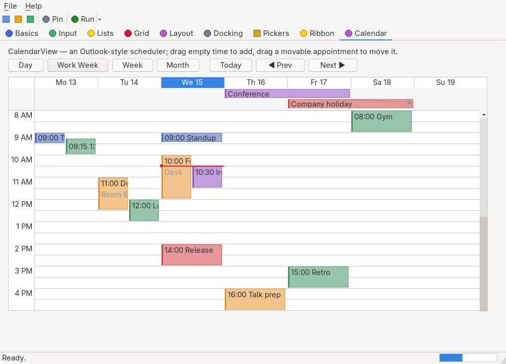

# NativeForms

[](LICENSE)
[](https://github.com/Hawkynt/NativeForms)

[](https://github.com/Hawkynt/NativeForms/actions/workflows/ci.yml)
[](https://github.com/Hawkynt/NativeForms/commits/main)
[](https://github.com/Hawkynt/NativeForms/pulse)

[](https://github.com/Hawkynt/NativeForms/stargazers)
[](https://github.com/Hawkynt/NativeForms/network/members)
[](https://github.com/Hawkynt/NativeForms/issues)
[](https://github.com/Hawkynt/NativeForms)
[](https://github.com/Hawkynt/NativeForms)

> A fast, tiny, trim/AOT-compatible UI toolkit with a Windows Forms-shaped API that renders through
> platform-native widgets (Win32, GTK, Cocoa) via P/Invoke — and paints the controls no platform
> offers natively in that platform's own visual style.

## ✨ What it is

NativeForms lets you write desktop UI with the ergonomics of `System.Windows.Forms` — `Form`,
`Button`, `Label`, a `Controls` collection, `Click` events — but each control is a **real native
widget** on the host OS, so your app looks and behaves like every other app on that desktop. Controls
no platform ships natively (a `DataGridView`, a rich `ListView`, an icon `ComboBox`) are **owner-drawn
in the platform's own theme**, so they still look native.

It is built to be **small and quick**: reflection-free, `IsAotCompatible`, buffered peer state,
value-type geometry, and no per-frame allocation — kilobytes of managed overhead, not megabytes.

**WinForms compatibility, honestly.** The API is WinForms-shaped, not WinForms-cloned: porting is
mostly a namespace swap, but reflection-bound surfaces (`DataBindings`, `DisplayMember`) become
delegates, a few defaults differ, and legacy corners like MDI are deliberate non-goals. The
deviations are documented per control — start with the base-class list in
[docs/controls/control.md](docs/controls/control.md#differences-from-systemwindowsformscontrol);
every page whose control diverges carries its own "Differences from WinForms" section.

## 📸 Screenshots

The bundled `NativeForms.Demo` is a tabbed gallery of every control. These are captured on Linux/GTK
by the demo's headless autopilot (`--autopilot`), which drives the whole gallery with synthesized
input and photographs it in-process:

| | | |
|:---:|:---:|:---:|
| <br>**Buttons, MVVM, toggles** | <br>**Text, spinners, dates** | <br>**Lists, trees, combos** |
| <br>**DataGridView (12 column kinds)** | <br>**Layout containers** | <br>**Dock / float / auto-hide** |
| <br>**File/folder/drive pickers** | <br>**Office-style ribbon** | <br>**Outlook-style scheduler** |

More: [docking drag overlays](docs/screenshots/docking-drag.png) · [the month scheduler](docs/screenshots/calendar-month.png) · [a modal MessageBox](docs/screenshots/messagebox.png) · [a context menu](docs/screenshots/context-menu.png). The full set lives in [`docs/screenshots/`](docs/screenshots/).

## 🧩 Architecture

```
Hawkynt.NativeForms                     Core: controls, layout, events, data-binding (no native code)
Hawkynt.NativeForms.Backends.Windows    Win32   via [LibraryImport]
Hawkynt.NativeForms.Backends.Gtk        GTK 3   via [LibraryImport]
Hawkynt.NativeForms.Backends.MacOS      Cocoa   (placeholder — on the roadmap)
```

Core never calls a native API; it drives platform **peers** through `IPlatformBackend`. An app
registers the backends it ships — all of them for "one binary, every platform", or just one to
shrink a single-platform build.

## 🚀 Quick start

```csharp
using Hawkynt.NativeForms;
using Hawkynt.NativeForms.Backends;
using Hawkynt.NativeForms.Backends.Gtk;
using Hawkynt.NativeForms.Backends.Windows;

BackendRegistry.Register(new Win32Backend());
BackendRegistry.Register(new GtkBackend());

var form = new Form { Text = "Hello", Bounds = new(0, 0, 320, 160) };
var button = new Button { Text = "Click me", Bounds = new(20, 20, 140, 36) };
button.Click += (_, _) => button.Text = "Clicked!";
form.Controls.Add(button);

Application.Run(form);
```

MVVM, MVC and MVP are all first-class: `ObservableObject`, `RelayCommand`/`RelayCommand<T>` and a
reflection-free two-way `PropertyBinding<T>` live in `Hawkynt.NativeForms.ComponentModel`. See
`NativeForms.Demo` for a bound counter.

## 📖 Documentation & supported controls

The full reference lives under **[`docs/`](docs/README.md)** — an [architecture
overview](docs/architecture.md), an [MVVM & data-binding guide](docs/mvvm.md), a [custom-control
authoring guide](docs/custom-controls.md), and one reference page per control (usage example, API
tables, behavior notes). What ships today:

| Family | Controls (each links to its reference page) |
|---|---|
| Windows & dialogs | [`Form`](docs/controls/form.md) (modal, border styles, window state, icon, topmost, opacity) · [`MessageBox` + file/folder/color/font dialogs](docs/controls/dialogs.md) |
| Text & input | [`TextBox`](docs/controls/textbox.md) · [`MaskedTextBox`](docs/controls/maskedtextbox.md) · [`RichTextBox`](docs/controls/richtextbox.md) · [`SearchBox`](docs/controls/searchbox.md) · [`NumericUpDown`](docs/controls/numericupdown.md) · [`DomainUpDown`](docs/controls/domainupdown.md) |
| Buttons & toggles | [`Button`](docs/controls/button.md) · [`CheckBox`](docs/controls/checkbox.md) · [`RadioButton`](docs/controls/radiobutton.md) · [`ToggleSwitch`](docs/controls/toggleswitch.md) · [`SplitButton` / `DropDownButton`](docs/controls/splitbutton.md) · [`GridPicker`](docs/controls/gridpicker.md) (Office table-size chooser) · [`LinkLabel`](docs/controls/linklabel.md) |
| Labels & media | [`Label`](docs/controls/label.md) · [`IconLabel`](docs/controls/iconlabel.md) (image **and** text) · [`PictureBox`](docs/controls/picturebox.md) · [`ImageList`](docs/controls/imagelist.md) (icons + badges) |
| Paths | [`FilePicker`](docs/controls/filepicker.md) (open/save, filters, multi-select) · [`FolderPicker`](docs/controls/folderpicker.md) |
| Ranges & dates | [`TrackBar`](docs/controls/trackbar.md) · [`HScrollBar` / `VScrollBar`](docs/controls/scrollbar.md) · [`ProgressBar`](docs/controls/progressbar.md) (incl. marquee) · [`ProgressTile`](docs/controls/progresstile.md) (Explorer-style drive tile) · [`DateTimePicker`](docs/controls/datetimepicker.md) · [`MonthCalendar`](docs/controls/monthcalendar.md) · [`TimePicker`](docs/controls/timepicker.md) (double-click for the analog [`ClockFace`](docs/controls/clockface.md)) |
| Lists & trees | [`ListBox`](docs/controls/listbox.md) · [`CheckedListBox`](docs/controls/checkedlistbox.md) · [`ComboBox`](docs/controls/combobox.md) · [`ListView`](docs/controls/listview.md) (5 views, groups) · [`TreeView`](docs/controls/treeview.md) · [`TreeListView`](docs/controls/treelistview.md) |
| Scheduling | [`CalendarView`](docs/controls/calendarview.md) — Outlook-style Day/Work Week/Week/Month scheduler, virtualized, side-by-side overlap packing, all-day band, "now" line |
| Data grid | [`DataGridView`](docs/controls/datagridview.md) — virtualized, 12 column kinds, editing, sorting, frozen columns, reorder, merged rows, clipboard copy/paste |
| Containers & layout | [`Panel`](docs/controls/panel.md) (AutoScroll) · [`GroupBox`](docs/controls/groupbox.md) · [`TabControl`](docs/controls/tabcontrol.md) · [`SplitContainer`](docs/controls/splitcontainer.md) · [`Expander`](docs/controls/expander.md) · [`Accordion`](docs/controls/accordion.md) · [`Ribbon`](docs/controls/ribbon.md) · [`DockPanel`](docs/controls/dockpanel.md) · [`FlowLayoutPanel`](docs/controls/flowlayoutpanel.md) · [`TableLayoutPanel`](docs/controls/tablelayoutpanel.md) |
| Menus, toolbars, status | [`MenuStrip`](docs/controls/menustrip.md) · [`ContextMenuStrip`](docs/controls/contextmenustrip.md) · [`ToolStrip`](docs/controls/toolstrip.md) · [`StatusStrip`](docs/controls/statusstrip.md) · [`ToolTip`](docs/controls/tooltip.md) · [`NotifyIcon`](docs/controls/notifyicon.md) · [`Breadcrumb`](docs/controls/breadcrumb.md) (Explorer navigation bar) |
| Non-visual | [`Application` & backends](docs/controls/application.md) · [`Control` base class](docs/controls/control.md) · [`Timer`](docs/controls/timer.md) |

`NativeForms.Demo` doubles as a tabbed gallery showing every one of these controls with
representative property settings, plus the MVVM counter wiring.

## 📋 Status

**`docs/PRD.md`** is the authoritative checklist of every control and feature — per-control
acceptance criteria (§7), the milestone roadmap (§10), and the tested/demo-ed/documented coverage
matrix (§11). The full WinForms-shaped control inventory above is implemented and tested; the PRD
tracks the remaining per-control refinements (focus model, DPI/dark-mode live switching, macOS
backend, and the items it explicitly marks later/optional) box-by-box.

## 🛠️ Build

```sh
dotnet build NativeForms.sln -c Release
dotnet test  NativeForms.sln -c Release
dotnet run  --project NativeForms.Demo         # needs GTK 3 on Linux; native on Windows
```

## ❤️ Support

If NativeForms is useful to you, consider supporting development:

[](https://github.com/sponsors/Hawkynt)
[](https://www.paypal.me/hawkynt)

## 📜 License

Licensed under LGPL-3.0-or-later — see [LICENSE](LICENSE).
