# NativeForms

[](LICENSE)
[](https://github.com/Hawkynt/NativeForms)

[](https://github.com/Hawkynt/NativeForms/actions/workflows/ci.yml)
[](https://github.com/Hawkynt/NativeForms/commits/main)
[](https://github.com/Hawkynt/NativeForms/pulse)

[](https://github.com/Hawkynt/NativeForms/stargazers)
[](https://github.com/Hawkynt/NativeForms/network/members)
[](https://github.com/Hawkynt/NativeForms/issues)
[](https://github.com/Hawkynt/NativeForms)
[](https://github.com/Hawkynt/NativeForms)

> A fast, tiny, trim/AOT-compatible UI toolkit with a Windows Forms-shaped API. Windows, buttons,
> labels and text boxes are real platform widgets (Win32, GTK) driven via P/Invoke; every other
> control is owner-drawn in the host platform's own visual style.

## ✨ What it is

NativeForms lets you write desktop UI with the ergonomics of `System.Windows.Forms` — `Form`,
`Button`, `Label`, a `Controls` collection, `Click` events — on top of two rendering strategies:

- **Real native widgets** for the window and the text-bearing primitives: [`Form`](docs/controls/form.md),
  [`Button`](docs/controls/button.md), [`Label`](docs/controls/label.md),
  [`TextBox`](docs/controls/textbox.md), [`MaskedTextBox`](docs/controls/maskedtextbox.md) and
  [`RichTextBox`](docs/controls/richtextbox.md). These are genuine `HWND`s / `GtkWidget*`s, so caret,
  IME, selection and accessibility come from the OS. The platform's own
  [`MessageBox` and common dialogs](docs/controls/dialogs.md) are used directly too, and
  [`Timer`](docs/controls/timer.md) (a native timer source) and
  [`NotifyIcon`](docs/controls/notifyicon.md) (Windows tray only) are non-visual native resources.
- **Owner-drawn, native-themed** for everything else — the lists, grids, trees, containers, menus and
  the modern extras. They render through `IGraphics` using an `ITheme` populated from live OS colors,
  fonts and metrics, so they match the desktop without being OS widgets.

That split is deliberate: one owner-drawn implementation behaves identically on every backend, which
is what makes a `DataGridView` or a `CalendarView` possible at all. It is also why the toolkit is not
a drop-in for platform accessibility on the drawn controls yet. Promoting the controls that *do* have
a faithful native counterpart (check boxes, combo boxes, progress bars, …) onto real peers when their
properties stay inside what the platform widget supports is a tracked workstream — see
[PRD §12](docs/PRD.md#12-native-peer-promotion-opt-into-real-widgets-where-the-platform-has-one).

It is built to be **small and quick**: reflection-free, `IsAotCompatible`, buffered peer state,
value-type geometry, and no per-frame allocation — kilobytes of managed overhead, not megabytes.

**WinForms compatibility, honestly.** The API is WinForms-shaped, not WinForms-cloned: porting is
mostly a namespace swap, but reflection-bound surfaces (`DataBindings`, `DisplayMember`) become
delegates, a few defaults differ, and legacy corners like MDI are deliberate non-goals. The
deviations are documented per control — start with the base-class list in
[docs/controls/control.md](docs/controls/control.md#differences-from-systemwindowsformscontrol);
every page whose control diverges carries its own "Differences from WinForms" section.

## 📸 Screenshots

The bundled `NativeForms.Demo` is a tabbed gallery of every control. These are captured on Linux/GTK
by the demo's headless autopilot (`--autopilot`), which drives the whole gallery with synthesized
input and photographs it in-process:

| | | |
|:---:|:---:|:---:|
| 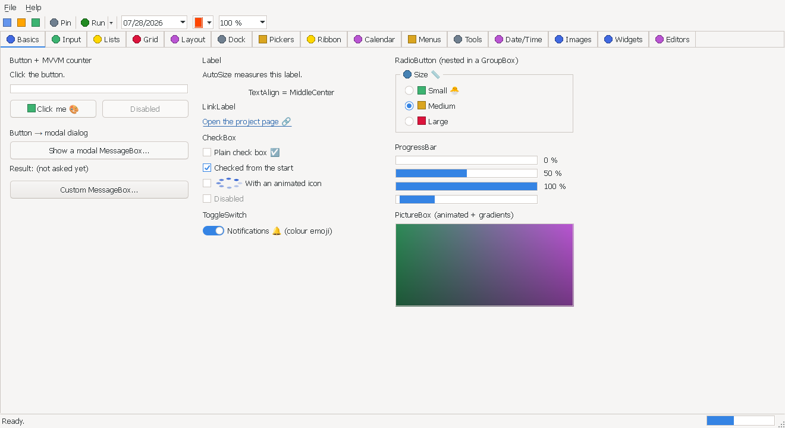<br>**Buttons, MVVM, toggles** | 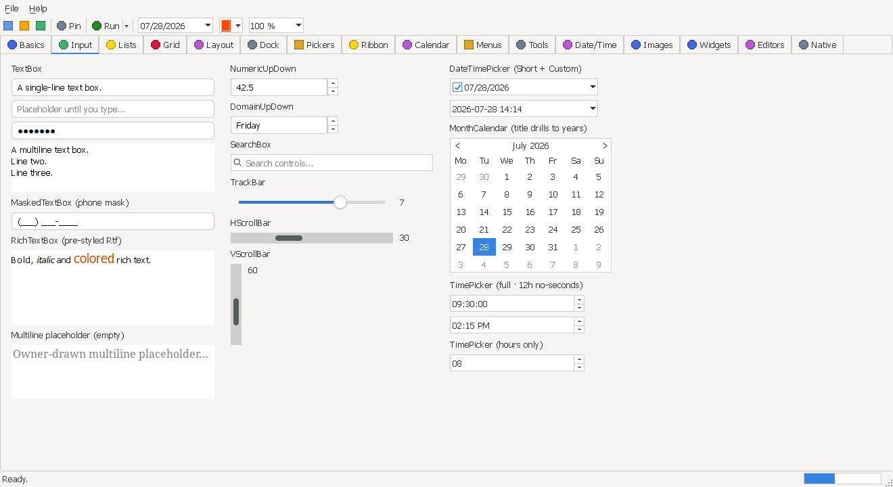<br>**Text, spinners, dates** | 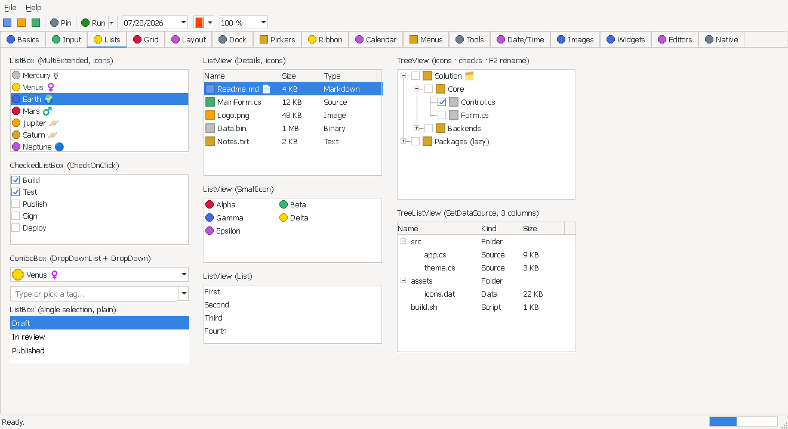<br>**Lists, trees, combos** |
| 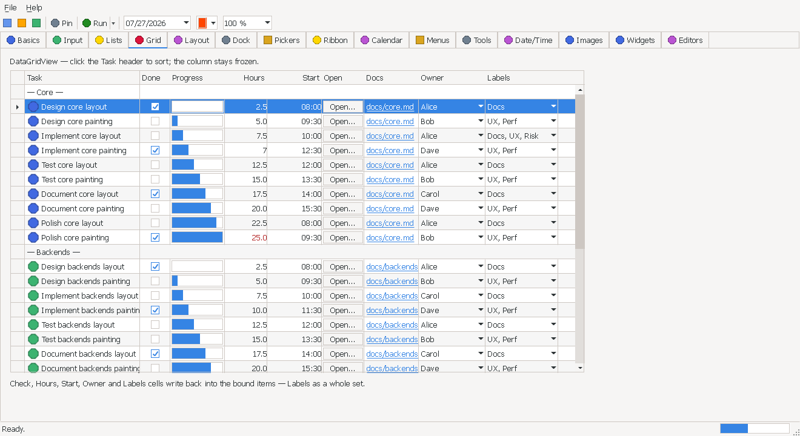<br>**DataGridView (15 column kinds)** | 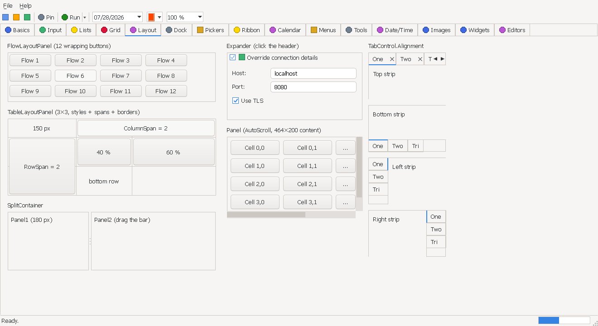<br>**Layout containers** | 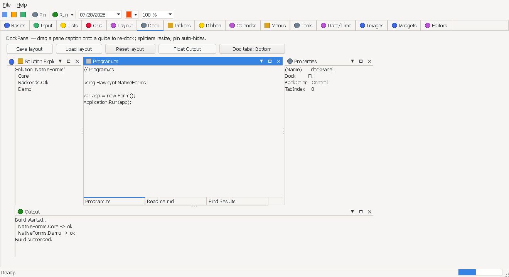<br>**Dock / float / auto-hide** |
| 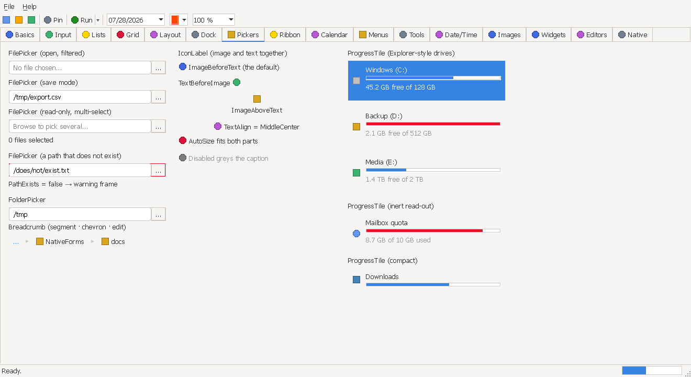<br>**File/folder/drive pickers** | 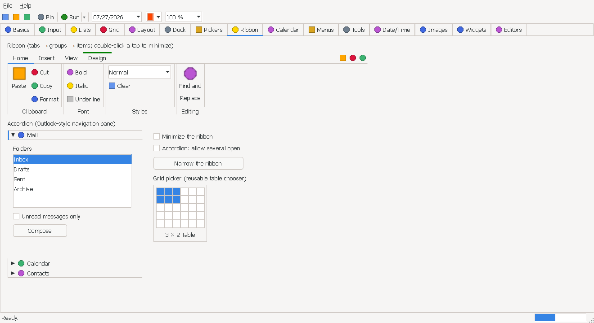<br>**Office-style ribbon** | 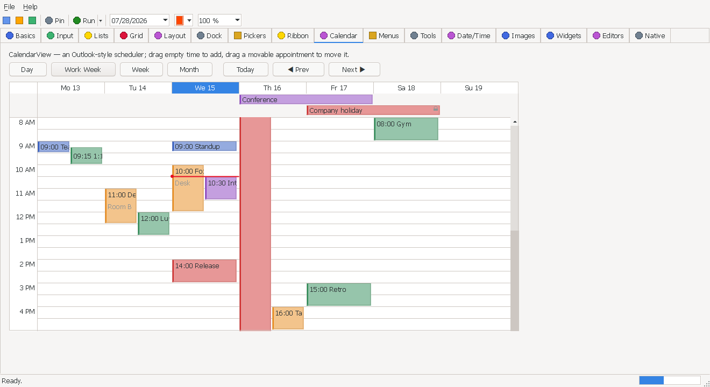<br>**Outlook-style scheduler** |
| 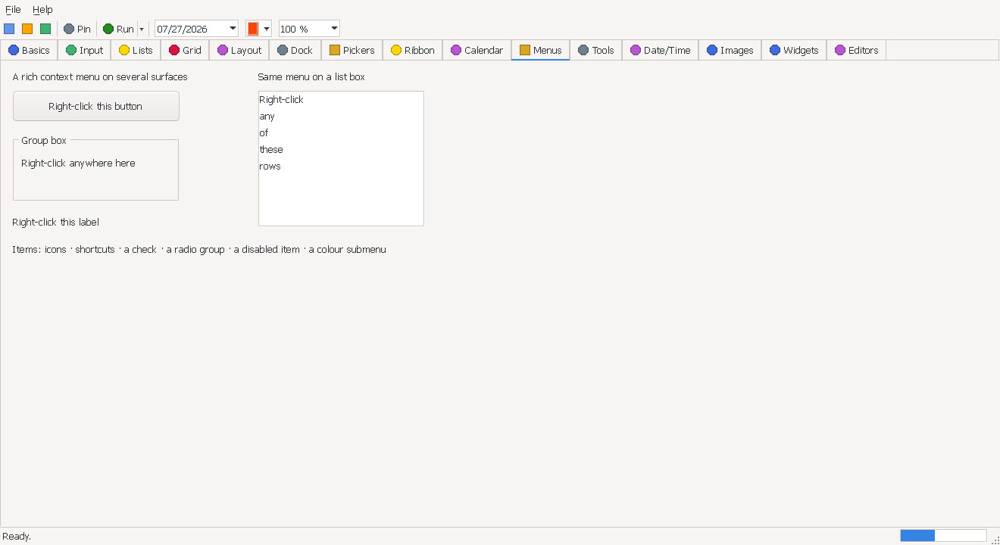<br>**Context menus & attach points** | 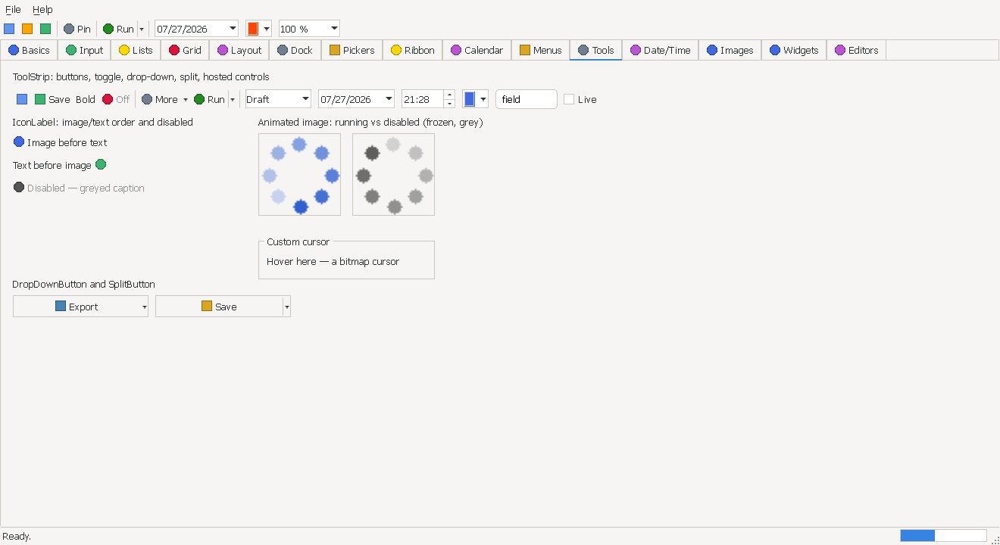<br>**Hosted controls, animation states** | 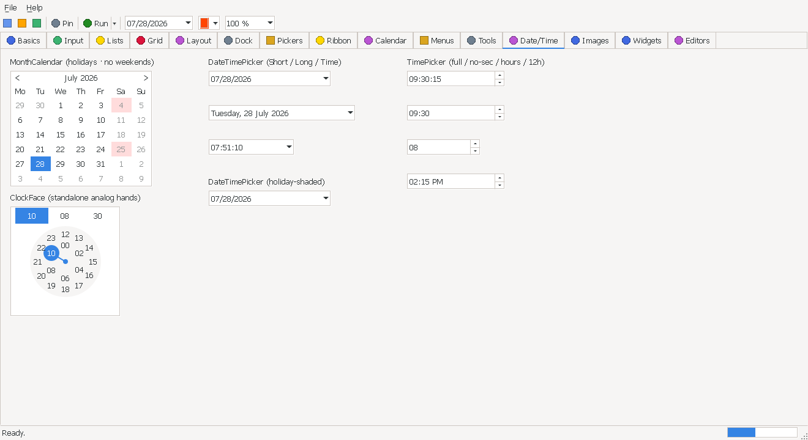<br>**Day shading, blocked days, pickers** |
| 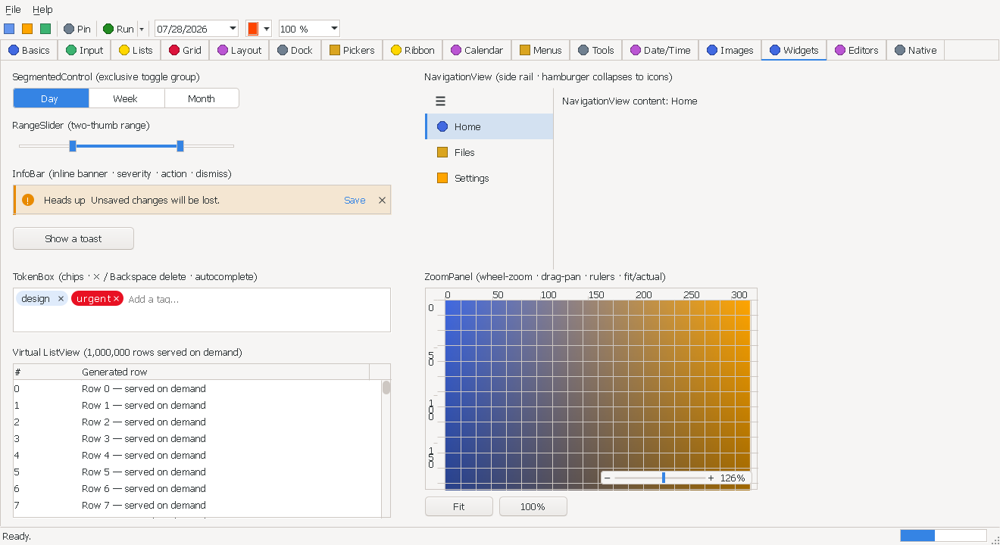<br>**App shell: rail, chips, toasts, zoom** | 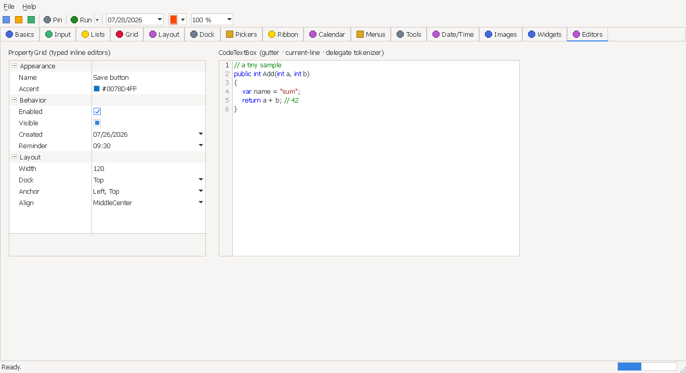<br>**PropertyGrid & code editor** | 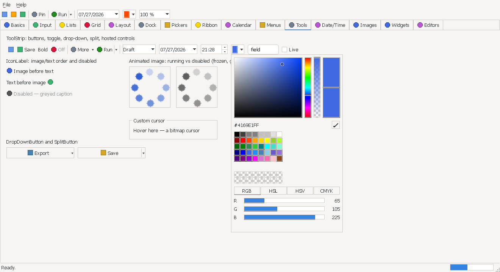<br>**ColorPicker mixer & numeric tabs** |

More: [docking drag overlays](docs/screenshots/docking-drag.png) · [the month scheduler](docs/screenshots/calendar-month.png) · [a modal MessageBox](docs/screenshots/messagebox.png) · [a context menu](docs/screenshots/context-menu.png). The full set lives in [`docs/screenshots/`](docs/screenshots/).

## 🧩 Architecture

```
Hawkynt.NativeForms                     Core: controls, layout, events, data-binding (no native code)
Hawkynt.NativeForms.Backends.Windows    Win32   via [LibraryImport]   — shipping
Hawkynt.NativeForms.Backends.Gtk        GTK 3   via [LibraryImport]   — shipping
Hawkynt.NativeForms.Backends.MacOS      Cocoa                         — NOT IMPLEMENTED (stub)
```

Core never calls a native API; it drives platform **peers** through `IPlatformBackend`. An app
registers the backends it ships — both for "one binary, every platform", or just one to shrink a
single-platform build.

**Platform support today: Windows and Linux.** macOS is a **future vision, not a shipped feature** —
`NativeForms.Backends.MacOS` is a stub whose every member throws `PlatformNotSupportedException` with
an actionable message. Nothing renders on macOS yet. The Cocoa/AppKit implementation (`NSApplication`,
`NSWindow`, `NSButton`, `NSTextField` over `objc_msgSend`) is planned in
[PRD §10, milestone M9](docs/PRD.md#10-milestones-the-completion-roadmap).

## 🚀 Quick start

```csharp
using Hawkynt.NativeForms;
using Hawkynt.NativeForms.Backends;
using Hawkynt.NativeForms.Backends.Gtk;
using Hawkynt.NativeForms.Backends.Windows;

BackendRegistry.Register(new Win32Backend());
BackendRegistry.Register(new GtkBackend());

var form = new Form { Text = "Hello", Bounds = new(0, 0, 320, 160) };
var button = new Button { Text = "Click me", Bounds = new(20, 20, 140, 36) };
button.Click += (_, _) => button.Text = "Clicked!";
form.Controls.Add(button);

Application.Run(form);
```

MVVM, MVC and MVP are all first-class: `ObservableObject`, `RelayCommand`/`RelayCommand<T>` and a
reflection-free two-way `PropertyBinding<T>` live in `Hawkynt.NativeForms.ComponentModel`. See
`NativeForms.Demo` for a bound counter.

## 📖 Documentation & supported controls

The full reference lives under **[`docs/`](docs/README.md)** — an [architecture
overview](docs/architecture.md), an [MVVM & data-binding guide](docs/mvvm.md), a [custom-control
authoring guide](docs/custom-controls.md), an [images, animation & custom cursors
guide](docs/imaging.md), and one reference page per control (usage example, API tables, behavior
notes). What ships today:

Families are listed alphabetically, and so are the controls inside each one.

| Family | Controls (each links to its reference page) |
|---|---|
| App shell & notifications | [`InfoBar`](docs/controls/infobar.md) (inline banner) · [`NavigationView`](docs/controls/navigationview.md) (collapsible side rail) · [`SegmentedControl`](docs/controls/segmentedcontrol.md) · [`Toast`](docs/controls/infobar.md#toast) (transient corner notification) |
| Buttons & toggles | [`Button`](docs/controls/button.md) · [`CheckBox`](docs/controls/checkbox.md) · [`ColorPicker`](docs/controls/colorpicker.md) (SV/wheel mixer, RGB·HSL·HSV·CMYK tabs, eyedropper) · [`GridPicker`](docs/controls/gridpicker.md) (Office table-size chooser) · [`LinkLabel`](docs/controls/linklabel.md) · [`RadioButton`](docs/controls/radiobutton.md) · [`SplitButton` / `DropDownButton`](docs/controls/splitbutton.md) · [`ToggleSwitch`](docs/controls/toggleswitch.md) |
| Containers & layout | [`Accordion`](docs/controls/accordion.md) · [`DockPanel`](docs/controls/dockpanel.md) · [`Expander`](docs/controls/expander.md) · [`FlowLayoutPanel`](docs/controls/flowlayoutpanel.md) · [`GroupBox`](docs/controls/groupbox.md) · [`Panel`](docs/controls/panel.md) (AutoScroll) · [`Ribbon`](docs/controls/ribbon.md) · [`SplitContainer`](docs/controls/splitcontainer.md) · [`TabControl`](docs/controls/tabcontrol.md) · [`TableLayoutPanel`](docs/controls/tablelayoutpanel.md) · [`ZoomPanel`](docs/controls/zoompanel.md) (wheel-zoom / drag-pan canvas) |
| Data grid | [`DataGridView`](docs/controls/datagridview.md) — virtualized, 15 column kinds, editing, sorting, frozen columns, reorder, merged rows, clipboard copy/paste |
| Editors & inspectors | [`CodeTextBox`](docs/controls/codetextbox.md) (gutter, tokenizer, completion) · [`PropertyGrid`](docs/controls/propertygrid.md) (typed rows, attribute-driven via source generator) |
| Labels & media | [`IconLabel`](docs/controls/iconlabel.md) (image **and** text) · [`ImageList`](docs/controls/imagelist.md) (icons + badges) · [`Label`](docs/controls/label.md) · [`PictureBox`](docs/controls/picturebox.md) |
| Lists & trees | [`CheckedListBox`](docs/controls/checkedlistbox.md) · [`ComboBox`](docs/controls/combobox.md) · [`ListBox`](docs/controls/listbox.md) · [`ListView`](docs/controls/listview.md) (5 views, groups, virtual mode) · [`TreeListView`](docs/controls/treelistview.md) · [`TreeView`](docs/controls/treeview.md) |
| Menus, toolbars, status | [`Breadcrumb`](docs/controls/breadcrumb.md) (Explorer navigation bar) · [`ContextMenuStrip`](docs/controls/contextmenustrip.md) · [`MenuStrip`](docs/controls/menustrip.md) · [`NotifyIcon`](docs/controls/notifyicon.md) · [`StatusStrip`](docs/controls/statusstrip.md) · [`ToolStrip`](docs/controls/toolstrip.md) · [`ToolTip`](docs/controls/tooltip.md) |
| Non-visual | [`Application` & backends](docs/controls/application.md) · [`Control` base class](docs/controls/control.md) · [`Timer`](docs/controls/timer.md) |
| Paths | [`FilePicker`](docs/controls/filepicker.md) (open/save, filters, multi-select) · [`FolderPicker`](docs/controls/folderpicker.md) |
| Ranges & dates | [`DateTimePicker`](docs/controls/datetimepicker.md) · [`HScrollBar` / `VScrollBar`](docs/controls/scrollbar.md) · [`MonthCalendar`](docs/controls/monthcalendar.md) · [`ProgressBar`](docs/controls/progressbar.md) (incl. marquee) · [`ProgressTile`](docs/controls/progresstile.md) (Explorer-style drive tile) · [`RangeSlider`](docs/controls/rangeslider.md) (two-thumb) · [`TimePicker`](docs/controls/timepicker.md) (double-click for the analog [`ClockFace`](docs/controls/clockface.md)) · [`TrackBar`](docs/controls/trackbar.md) |
| Scheduling | [`CalendarView`](docs/controls/calendarview.md) — Outlook-style Day/Work Week/Week/Month scheduler, virtualized, side-by-side overlap packing, all-day band, "now" line |
| Text & input | [`DomainUpDown`](docs/controls/domainupdown.md) · [`MaskedTextBox`](docs/controls/maskedtextbox.md) · [`NumericUpDown`](docs/controls/numericupdown.md) · [`RichTextBox`](docs/controls/richtextbox.md) · [`SearchBox`](docs/controls/searchbox.md) · [`TextBox`](docs/controls/textbox.md) · [`TokenBox`](docs/controls/tokenbox.md) (tag/chip input) |
| Windows & dialogs | [`Form`](docs/controls/form.md) (modal, border styles, window state, icon, topmost, opacity) · [`MessageBox` + file/folder/color/font dialogs](docs/controls/dialogs.md) |

`NativeForms.Demo` doubles as a tabbed gallery showing every one of these controls with
representative property settings, plus the MVVM counter wiring.

## 📋 Status

**`docs/PRD.md`** is the authoritative checklist of every control and feature — per-control
acceptance criteria (§7), the milestone roadmap (§10), and the tested/demo-ed/documented coverage
matrix (§11). The control inventory above is implemented and tested on **Windows and Linux**; the PRD
tracks the rest box-by-box: the focus model, DPI/dark-mode live switching, accessibility, the macOS
backend, native-peer promotion (§12), and the items it explicitly marks later/optional.

## 🛠️ Build

```sh
dotnet build NativeForms.sln -c Release
dotnet test  NativeForms.sln -c Release
dotnet run  --project NativeForms.Demo         # needs GTK 3 on Linux; native on Windows
```

## ❤️ Support

If NativeForms is useful to you, consider supporting development:

[](https://github.com/sponsors/Hawkynt)
[](https://www.paypal.me/hawkynt)

## 📜 License

Licensed under LGPL-3.0-or-later — see [LICENSE](LICENSE).
