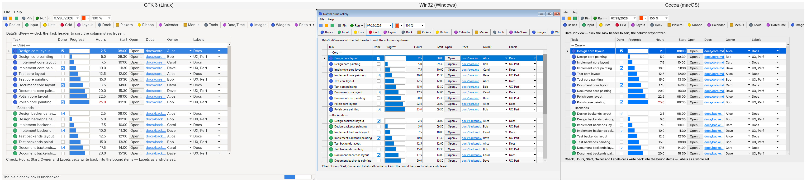
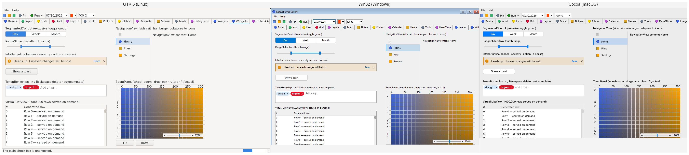

# Backends: what differs, and what it looks like

One `Control` tree, three native implementations. This page is the honest account of where they
diverge — because they do, and a toolkit that claims otherwise is hiding something you will find on
the day you ship.

The screenshots are the same gallery, the same page, taken by the same walkthrough on each platform:
`dotnet run --project NativeForms.Demo -- --shoot <dir>` writes one PNG per page using each backend's
own in-process capture. Nothing is staged, and nothing is a mock-up.

## At a glance

| | **GTK 3** (Linux) | **Win32** (Windows) | **Cocoa** (macOS) |
|---|---|---|---|
| Status | Complete | Complete | **Under construction** |
| Owner-drawn painting | Cairo | GDI | CoreGraphics |
| Text measurement & drawing | Pango | GDI, DirectWrite for colour glyphs | CoreText |
| Native widget promotion (§12) | 9 controls | 9 controls | 9 controls; a slider keeps no step sizes and a drop-down opens modally |
| Colour emoji in owner-drawn text | via Pango | via Direct2D/DirectWrite | via CoreText |
| Accessibility | ATK | MSAA, borrowed from a shadow control | NSAccessibility |
| Mouse & keyboard | complete | complete | press, drag, wheel, keys; CI witnesses posted clicks toggling controls and posted keys reaching editors, hover only wired |
| Dialogs (message box, file, colour, font) | complete | complete | all four native (`NSAlert`, `NSOpen`/`NSSavePanel`, `NSColorPanel`, `NSFontPanel`); the two panels have no Cancel, so cancelling is inferred |
| CI verification | autopilot, 160 checks, gating | 16-page shoot + real `SendInput`, gating | 16-page shoot + `NSEvent`s posted into the application's own queue (no Accessibility grant needed), reporting |

## Side by side

Left to right: GTK 3, Win32, Cocoa.

### DataGridView

### Widgets

## Where the differences come from

**Chrome belongs to the platform.** The Win32 shot carries a title bar because the capture is of the
window; GTK and Cocoa capture the client area. None of that is the toolkit's doing, and none of it is
worth normalising — a window that looks foreign on its own desktop is the failure this project exists
to avoid.

**Fonts and metrics differ, so layout differs.** Each backend measures with the platform's own text
engine, so the same label is a different number of pixels wide on each. Controls that size to their
content therefore differ slightly in width between the columns above. This is deliberate: measuring
with anything other than the engine that will draw the text produces layout that is wrong everywhere
rather than consistent everywhere.

**Scroll bars, check marks and focus rings are the desktop's, not ours.** Owner-drawn controls query
`ITheme` for colours, metrics and fonts, so a check box drawn by the toolkit follows the same palette
as one drawn by the platform. The shapes are ours; the values are the desktop's.

**Native promotion changes what is drawn at all.** On GTK and Win32 nine controls realise onto real
platform widgets when nothing in their state needs the painter (PRD §12) — a `CheckBox` is a real
`GtkCheckButton` or `BUTTON`, until you give it an image no platform box draws beside its caption, at
which point it swaps to the owner-drawn twin and swaps back when you take it away. Cocoa now promotes
all nine too, on top of `Label`, `Button` and `TextBox`, which are always native there; everything
else is owner-drawn. Two of the nine keep something back on that backend, and the macOS section below
says which.

**A string too tall for the box it was given fails three different ways.** `DrawTextW` clips it,
Cairo and CoreText let it spill over whatever is underneath. A control that hands text a box smaller
than the font needs therefore looks merely cramped on one platform, mutilated on the second and
illegible on the third — which is what the `ZoomPanel`'s vertical ruler did until it stopped guessing
at a line height and started measuring one. The rule that follows is worth stating once here rather
than relearning per control: a box for text is measured, never assumed, because no backend will tell
you it did not fit.

## The Win32 backend, specifically

It is complete, and one thing about it has to be said out loud that the other two never need to say.

**A stock control wears the desktop's font because the toolkit sends it one.** A `GtkWidget` and an
`NSTextField` are built already wearing the font the desktop is set to. A Win32 `EDIT`, `BUTTON` or
`STATIC` that is never sent `WM_SETFONT` does not fall back to it — it draws in GDI's `SYSTEM_FONT`,
the proportional raster face from Windows 3.1 — and the peer used to send one only when the
application had named a font, which almost no application does. So every native caption in the
gallery photographed in a bitmap face while the owner-drawn ones two pixels away were Segoe UI, and
the characters that face has no glyph for came out as the missing-glyph bar: "DataGridView — click
the Task header" photographed as "DataGridView I click the Task header", and every button whose
caption ended in `…` ended in a bar instead.

The two characters are the tell rather than the fault. `—` and `…` sit at 0x97 and 0x85 in cp1252, in
the block a raster font older than that code page leaves undefined, which is exactly why the `×` in
"150×70" standing between them was always right: it is at 0xD7, inside the range such a face does
define. Both were in Segoe UI all along and both were correct on GTK and on Cocoa, so it read for a
long time as a font-fallback failure somewhere in the text path — and the painter was never involved
at all. The peer now applies the theme's own font whenever the application named none, which is the
same font the painter resolves, so a caption and the string drawn beside it agree by construction.

**The placeholder needs the application's own manifest, and so does half the rest of this backend.**
A greyed hint inside an `EDIT` is `EM_SETCUEBANNER`, and only ComCtl32 version 6 answers it — that
assembly re-registers the stock window classes for any process bound to it, so the same `EDIT` is a
different implementation depending on a declaration made before a line of the program ran. The
binding is a side-by-side dependency in the process's own manifest, read at load time. The peer sent
the message all along and an unmanifested process dropped it, so the hint was simply missing from
every Windows shot while GTK and Cocoa drew theirs. The gallery now ships
`NativeForms.Demo/app.manifest`, and an application built on this toolkit should copy it: without it
the process gets the stock controls Windows 2000 shipped — bevelled scroll bars, dithered tracks, no
cue banner, and no `SysLink` class for a `LinkLabel` to promote onto, so that control quietly stays
owner-drawn.

There is a second route and it is worth naming, because leaving it out would make the manifest look
like the only one: `CreateActCtx` over a manifest resource, activated and deactivated around every
`CreateWindowEx`, which is what Windows Forms' `EnableVisualStyles` does. It is not taken here for
two reasons. It needs a manifest resource in a file on disk to point at, and the build this toolkit
exists for is a single-file NativeAOT executable whose only manifest is the process one being argued
about. And it puts an activate/deactivate pair on the creation path of every widget, to buy per
window what one declaration buys once, at load, for nothing. Which controls a process gets is also
the application's decision rather than a library's to make on its behalf, so it is left where the
declaration is.

**A multiline box shows no hint here, and is not given a drawn one.** `EM_SETCUEBANNER` is a
single-line message and a multiline `EDIT` ignores it, manifest or no manifest. GTK paints the hint
itself after the `GtkTextView`'s own draw, which is sound there because the toolkit owns that
surface's exposure; the same move on Win32 means painting into a window whose caret, selection
highlight and scroll position all belong to USER32, so the toolkit would be putting text where the
editor is about to put a caret and neither would know about the other. So the multiline placeholder
is stated as absent on this backend rather than approximated.

**The binding changes more than the hint, and the shots say what.** Every page moves: a promoted check
box, radio button and combo box arrive in the desktop's own drawing rather than in Windows 2000's, a
progress bar is a continuous run rather than a row of blocks, a track bar takes the accent-coloured
thumb, and the cue banner turns up in an editable `ComboBox`'s edit as well as in a `TextBox`. One
consequence is worth naming because it reads as a regression and is not: Windows 11 draws a themed
scroll bar as a hairline with no arrow buttons until the pointer is over it, so the gallery's
standalone `HScrollBar` and `VScrollBar` — which nothing is hovering while a capture is taken —
photograph as a thin line and a small thumb where they used to photograph as the whole classic
control. That is this desktop's scroll bar, which is the entire point.

## The macOS backend, specifically

It is genuinely incomplete, and the table above says so rather than leaving you to discover it.

Working: AppKit loads, windows open, the view hierarchy builds with the toolkit's coordinates,
the event loop runs, owner-drawn painting and text render through CoreGraphics and CoreText, images
and text measurement work, the clipboard works both ways, a multiline `TextBox` is a real
`NSTextView` in an `NSScrollView`, a `NotifyIcon` is a real `NSStatusItem` in the menu bar, and the
gallery's sixteen pages all pass the walkthrough's state round-trip and layout audit.

Not working yet: hover is routed into the toolkit but not verified end to end the way the Win32
backend's is. Presses and keys now are — the probe posts them and reports how many arrived, which on
the last run was two clicks toggling a control and seven keystrokes reaching a focused editor.
Everything else this backend still declines is listed at the end of this section, split into what the
platform does not have and what has not been written.

An owner-drawn icon reaches the screen. It did not until now — every control that shows a picture it
draws itself, which is the toolbar buttons, the list and tree rows, the grid cells, the tab headers
and the `PictureBox`, put down a blank where the icon goes. What was missing was the conversion: the
backend kept an application's bitmap as the straight-alpha integers the core handed over, and
CoreGraphics draws a `CGImage` or nothing. It is built on the first draw and kept, because converting
costs a colour space, a bitmap context and a pass over every pixel, and doing that per frame per icon
is what a grid full of them would cost. Two details are worth stating rather than rediscovering. The
row stride is read back off the context instead of assumed: a bitmap context may pad its rows for
alignment, and tightly packed rows written into a padded buffer shear the picture diagonally. And the
flip is local — `CGContextDrawImage` lays an image out from the bottom of its rectangle upward, which
is right in CoreGraphics' coordinates and upside down in this one, so the painter mirrors the context
about the destination rectangle inside a saved state rather than flipping the context, which would
put every string on its head as well.

A disabled icon is grey here too. A control does not compute the dimming itself — it asks the bitmap
for its greyed sibling and draws that, which is how the look lives with the image rather than being
reinvented by every control that shows one — and this backend answered nothing, so the toolbar's off
button, the disabled icon label and the frozen picture box photographed in full colour on macOS while
the other two showed them grey. The sibling is built on the first disabled draw and kept, for the same
reason the `CGImage` is. It is computed from the straight-alpha pixels the core handed over rather
than from the `CGImage`, whose channels are already scaled by their own alpha — weighting those would
darken a half-transparent icon a second time. The channel weights are the ones the Cairo and GDI
backends use, so "disabled" is one grey across all three rather than each renderer's own.

A button carries its icon. That call did nothing here, which made this the one backend where an
image-bearing button showed only its caption — and the gallery's own "Click me" is one, so the
difference sat in every macOS shot of the first page. It is served rather than declined, because
neither of the other two demotes such a button either: GTK hands the icon to `gtk_button_set_image`
and places it with the button's own image position, and Win32 attaches it with `BM_SETIMAGE`.
`NSCellImagePosition` has exactly the four places GTK's has, so `TextImageRelation` maps across one for
one; overlay takes the left-hand place, which is what GTK does with it, because a caption printed over
an icon on one platform of three is a difference an application cannot design around. The nine-way
image alignment is carried and not rendered, which is what the seam already says of the other two — a
button places its image relative to its caption, and there is no second anchor to give it. The
`NSImage` is handed over and released, since the button retains it: an animated image arrives once per
frame, and the frame before goes away when the button lets go of it rather than piling up.

The window holds the chrome the form asked for, with one refusal. Resize limits go to `setMinSize:`
and `setMaxSize:`, which constrain the frame rather than the content — the same measurement the
toolkit states its bounds in here, so the number a caller gives is the number the user drags against,
chrome included, exactly as on the other two platforms. A zero component lifts the limit: zero is
already AppKit's own minimum, and the maximum goes back to the enormous value it starts at rather than
to zero, which would pin the window shut. The minimize and maximize boxes grey their traffic lights
rather than removing them, because the lights are three and always in that order and a window missing
one reads as broken instead of as restricted; both flags are buffered, since a border-style change
rewrites the style mask and AppKit rebuilds the caption from it. `SetIcon` is not a gap here, it is a
property this desktop does not have: a window has no
icon on it — the caption shows a proxy icon only for a window standing for a file on disk,
and the only icon a running process can set is the application's own in the Dock, which is one per
process where the property is one per window, so a second form would silently replace the first
form's. There is nothing to implement and nothing being put off; an application that wants an icon on
macOS ships one in its bundle. The probe reads all of the rest back off the live window, and because
the gallery sets a minimum size of its own that line is a round trip rather than a statement of
wiring.

A native widget wears the font and the colours the application gave it. Those two calls did nothing
before, so a `Label` told to be red and bold on macOS was neither. Both are offered with
`respondsToSelector:` rather than sent, because they are `NSControl`'s and a peer whose handle is a
plain `NSView` would abort the process on an unrecognized selector instead of ignoring it. Three
details: bold and italic are traits here rather than part of a font's name, so the family is resolved
first and then converted through `NSFontManager` — asking for "Helvetica Bold" by name works for the
few families that ship one under that name and answers nothing for the rest; a background colour is
switched on as well as set, since AppKit's text widgets carry a colour they do not draw and a label is
built with `drawsBackground` off on purpose; and a button's title colour is not served at all, because
`NSButton` has no `setTextColor:` and the only way past that is an attributed title, which would then
own the font and the mnemonic too. This is implemented but not witnessed: the gallery sets no font or
colour on a native widget, so nothing in the probe's shots or its census would change if it regressed.

A rounded rectangle is round here too. It was square until now — the two calls forwarded to their
square siblings, which is why the toggle switch's pill, the toast, the info bar and the progress tiles
photographed with corners the other two backends do not draw. CoreGraphics has no rounded-rectangle
primitive below the path layer, so the path is built from four corner arcs:
`CGContextAddArcToPoint` is given the corner being cut and where the path goes next, and fits an arc
tangent to both, which describes the shape by the rectangle's own corners instead of by four centres
and eight angles worked out by hand. The radius is clamped to half the shorter side exactly as the
Cairo backend clamps it, so a pill asked for more radius than it can hold is a capsule on both rather
than whatever each renderer would invent.

A caption asked to be centred is centred. It was right-aligned, on every macOS run, from the one
enumeration on this platform whose values depend on the ABI rather than on the OS version: AppKit's
original `NSTextAlignment` is left, right, centre, and 10.12 renumbered it to UIKit's left, centre,
right everywhere `TARGET_ABI_USES_IOS_VALUES` holds — which is everything except 64-bit Intel. One
number for both exchanges right with centre on exactly one of the two architectures, and the wrong
one is the one nearly every Mac now is. The number is chosen by the process architecture now, the
same way the float-returning message send already chooses its entry point. Left was never affected,
which is why nothing but a screenshot was ever going to catch it: the gallery's centred label sat
hard against the right edge of its box for as long as this backend had a label at all.

The palette and the UI font are the desktop's. This backend served the shared fallback theme until
now — a Windows palette and Segoe UI at 9pt, on a desktop that has neither font nor palette. The size
is the part that did visible damage rather than the names: a point is a pixel here and 96 dpi's worth
of one on Windows, so every owner-drawn string photographed about a quarter smaller than the text
beside it in a real `NSTextField`, and a label that measures itself came out too narrow for its own
caption — measured with the theme's font, drawn by AppKit with the system's, and clipped by the
difference. The colours now come from `NSColor`'s semantic ones, the font from
`systemFontOfSize:0`, which is AppKit's way of being asked for the size it would use itself, and the
double-click interval from `NSEvent`. Four things about the reading are worth stating. Every send is
guarded by `respondsToSelector:`, because several of these colours arrived in 10.14 and an
unrecognized selector aborts the process rather than answering nil. Each colour is converted into
sRGB before its components are read, for the same reason the colour chooser converts — a semantic
colour resolves against the current appearance and has no red component until it is in a space that
has one. And alpha is kept rather than flattened the way a `COLORREF` arrives: `separatorColor` is a
tenth of an opaque black, and forcing it opaque would draw every border on the desktop in black. And
a control surface is `windowBackgroundColor`, not `controlColor`, which reads like the obvious answer
and is the wrong surface: it is the white a bezelled control fills itself with, and serving it made
every panel, page and button at rest the colour of a text field — the gallery photographed as one
sheet of white paper with an `ECECEC` tab strip laid across the top, a seam no macOS window has, and
the `ClockFace` dial, a filled ellipse in that colour over a field-coloured surface, went white on
white and left only its numbers and its hand in the shot. The other two backends already give the
window and a control surface the same value, `COLOR_BTNFACE` twice on Win32 and the theme background
twice on GTK, because a control at rest is chrome; fields stay `textBackgroundColor`, so the
distinction the seam carries — chrome against paper — is the one that survives. The
scrollbar metric stays the shared 16, which is what a legacy `NSScroller` reports anyway and what this
backend draws its own scrollbars at. What is not served is the change: the snapshot is right for the
appearance the application started in, and following the user into dark mode needs an observer on
`effectiveAppearance` that nothing here installs yet.

Owner-drawn text is the colour and the weight it was asked for. Until now it was black and regular on
every page of every shot, from two independent causes that look like one. CoreText does not fill
glyphs with the context's fill colour: it uses the string's own foreground attribute, which defaults
to black, so setting the fill colour before `CTLineDraw` — which is what every other primitive here
does and what GDI and Cairo both honour — changed nothing. The syntax colouring in the gallery's code
box, the grid's coloured cells and every caption drawn in anything but the text colour arrived black.
The attributes now carry `kCTForegroundColorFromContextAttributeName`, which is the instruction to
honour the context after all. The other way round is a `CGColorRef` under
`kCTForegroundColorAttributeName`; it was not taken because it would make the attribute dictionary
vary by colour as well as by font, and would state the colour through a second colour space while
everything else on this backend states it in device RGB. And a trait is not part of a name here:
`CTFontCreateWithName` takes a family and a size, so bold and italic never reached the font at all and
a heading photographed at the weight of its body text. The face is copied with symbolic traits
instead, which asks the family for the face rather than hoping it ships one called "… Bold"; a family
that has none answers null and keeps the plain face, which is what the native-widget path does through
`NSFontManager` for the same reason.

Underline and strikeout are drawn rather than attributed. CoreText has an attribute for the first and
none at all for the second — strikethrough is AppKit's — so one of the two had to be a rule drawn by
hand and both are, which is what makes them share a thickness, a colour and a length. The metrics come
off the family, so the underline sits where that family's designer put it. This is more than the Cairo
backend does, which carries only weight and slant into Pango, and matches GDI, which gets all four out
of one `HFONT`.

Fonts and their attribute dictionaries are cached for the process lifetime, one per face, because §4
forbids per-frame allocation on the paint path and a repaint asks for the font it asked for last time.
What is still built per call is the string, the attributed string and the line, all three of which
depend on the text. The cache never releases, which is also what lets the attribute dictionaries hold
their font without retaining it.

The colour and font choosers now answer, and the shape of the answer is worth reading before relying
on it. Both are shared modeless panels here — the platform keeps exactly one of each and shows it —
so neither has an OK, a Cancel, or any notion of being dismissed with a result. What makes them fit a
blocking call is a modal *session*: `beginModalSessionForWindow:` and `runModalSession:`, pumped until
the panel is no longer visible. `runModalForWindow:` is the obvious call and the wrong one, because it
ends when something calls `stopModal` and nothing on either panel ever does. A panel that refuses to
appear at all ends the wait immediately rather than blocking on a window nobody can see.

Cancellation is therefore inferred, not reported: the colour chooser answers the colour if the user
changed it and nothing if they did not, and the font chooser does the same by comparing what
`NSFontManager` converts the incoming font into against the font it was given. For any caller the two
readings are the same outcome — a dialog that hands back exactly what it was passed has changed
nothing — but an application that distinguishes "cancelled" from "confirmed the current value" will
see the first where Windows would give it the second. The colour comes back through sRGB rather than
raw: a colour picked from the crayon or spectrum pickers lives in whatever space that picker works in,
and asking such a colour for its red component raises rather than converting.

This is also the one thing on this page that CI does not exercise. A modeless panel ends when a person
closes it, and no runner has one; a probe that opened either would hold the job until its timeout and
report nothing. What the probe does check is that both shared objects resolve, which rules out the
silent failure — a chooser whose class never resolved answers null forever, and that is
indistinguishable from a user who cancels every time.

Hover is asked for in both places AppKit needs it asked. A window generates no mouse-moved events
until `setAcceptsMouseMovedEvents:` says so, and even then it sends `mouseMoved:` to whichever view
holds the keyboard rather than to the one under the pointer — so each canvas carries an
`NSTrackingArea` as well, in-visible-rect so it follows the view when the layout moves it and
active-always because a menu surface is never the key window. The same area is what delivers
`mouseEntered:`/`mouseExited:`, so a highlight goes out again. What the probe can show is the wiring:
it reads back off the running window whether moved events are accepted and how many views carry a
tracking area — 187 of the gallery's, one per owner-drawn canvas; the rest are AppKit's own controls,
which track themselves. (Only the tracked count is worth reading: the total moves run to run with how
much of the tab strip has realized by the time the shutter arms.) What it does not show is delivery.
That is now a gap in the probe rather than in the platform: it posts presses and keys and no moves,
because nothing in the walkthrough asserts on a highlight — so hover is still stated here as wired
rather than as witnessed, and the honest reason is that nobody has written the check.

A native widget hears the pointer as well, which it did not before. A canvas hears it because its
class carries the methods, and an `NSButton` is AppKit's class and can be given none — so its tracking
area is owned by a run-time object instead, which turns `mouseMoved:` and `mouseExited:` into the
peer's hover channel. That area goes on at the first subscriber rather than in the constructor: the
core subscribes to a peer's hover channel only for a control something is watching, which today means
a control with a tooltip, so a window of three hundred widgets grows a handful of tracking areas
instead of three hundred.

The tooltip is the platform's own, and arrives on the platform's own timing. An `NSView` carries a
`toolTip` and AppKit draws it when it judges the pointer has rested long enough; there is no message
that raises one now, which is what the toolkit's seam asks for. So the text is handed over once the
toolkit's own delay has elapsed and the desktop decides the moment after that — late on the hover that
asked for it, prompt on every hover after. Both other backends show it on the hover that triggered
them: GTK is asked to re-run its tooltip query at once, and the Win32 tool is registered with
`TTF_SUBCLASS` and activated. An empty text is `setToolTip:nil`, which is what the seam means by
hiding one. None of this could be reached until the paragraph above existed, because the core hands a
native widget's tip over from its hover timer and a native widget here delivered no hover at all.

Neither half is witnessed. A tip is drawn in a window of the platform's own that a capture of the
gallery's content view does not contain, and the pointer that would raise it is the one nothing posts.
What the probe reads back is the wiring: how many AppKit widgets report the pointer to
the toolkit, which in the gallery is one — the tipped button on the first page. Every other tipped
control there is owner-drawn, and an owner-drawn control is watched through its canvas instead.

The pointer changes shape, by whichever of AppKit's two routes the widget under it leaves open. There
is no message that sets a cursor on a view: a view declares the rectangles it wants a shape over
inside `resetCursorRects`, which AppKit calls when it decides they are stale — so the toolkit's wish is
parked in a map the callback reads, the same static-map-instead-of-a-closure shape every other
callback here uses, and the canvas class grows that one method beside its `drawRect:`. A widget AppKit
built has a class this backend cannot add a method to, so a native control takes the other route: a
tracking area asking for cursor updates, owned by a run-time class that answers `cursorUpdate:` by
setting the shape. That area goes on only when an application actually asks for a shape, because a
text field already puts an I-beam over itself and a rectangle laid over that unasked would take the
platform's own answer away.

Five of the toolkit's shapes have no published equivalent here and take the arrow rather than
something that merely looks close. The wait and app-starting pointers belong to the window server,
which raises one when a process stops answering, and no message asks for it; the help pointer and the
two diagonal resize arrows are not in `NSCursor`'s set at all, and a horizontal arrow over a corner
grip points the wrong way. The splitter shapes take the plain resize arrows, which is what the Win32
backend does with them for the same reason, and "move everything" takes the open hand, because that is
how this desktop says a thing can be picked up and there is no four-headed arrow to say it with. A
custom bitmap cursor is built from the same pixels the other two backends build theirs from, hotspot
passed straight through: AppKit reads it in the image's own coordinates from the top left, which is
the corner the toolkit counts from.

Nothing can witness a cursor — not for want of an Accessibility grant this time, but because a capture
is the window drawing itself while the pointer is the window server's, painted over the top of every
window on the desktop. So this is stated as wired, and the probe reads back the two things wiring
means: that the canvas class carries a `resetCursorRects` of its own rather than `NSView`'s, which the
runtime answers directly since it hands back the same method object when a subclass has overridden
nothing, and how many AppKit widgets carry the toolkit's cursor-update target. The gallery's toolbars
page puts a custom bitmap cursor on a group box, whose host view is one of ours, and on the label
inside it, which is an `NSTextField` — so each route has one to serve.

All nine of PRD §12's promotions are served. `CheckBox` and `RadioButton` become an `NSButton` in its
switch and radio types, `ProgressBar` an `NSProgressIndicator`, `GroupBox` an `NSBox` filling a plain
flipped view that holds the children on top of it — the frame and the caption come from the desktop,
and the children keep the bounds the application gave them rather than being shifted by the inset
AppKit reserves — `ListBox` an `NSTableView` in an `NSScrollView`, `LinkLabel` an `NSTextField`
carrying an attributed link, `ComboBox` an `NSPopUpButton`, `HScrollBar`/`VScrollBar` an `NSScroller`
and `TrackBar` an `NSSlider`. Grouping for radios stays in the core; AppKit's own rule is the same one
(buttons sharing a superview), so the two cannot reach different answers.

An `NSButton` in its switch and radio types is sensitive over its box and its title and nowhere else
in the frame it was given, which is this desktop's rule and not one worth standing in front of. Both
other platforms differ: a `BS_AUTOCHECKBOX` and a `GtkCheckButton` take a press anywhere in the
rectangle, and so does the owner-drawn twin, whose hit test is the client area. So a check box laid
out wider than its caption is the one place where the promoted control and the painted one answer the
same click differently — which is a real hole in "the public surface is identical either way", stated
here rather than closed by intercepting the cell's own hit test and making the widget stop behaving
like one. It is also what three of the probe's five posted clicks were falling into.

The last three each needed a decision the obvious reading gets wrong, and each keeps something back
rather than approximating it.

`NSPopUpButton`'s items are added as `NSMenuItem`s straight into its menu, not through
`addItemWithTitle:`. That call looks obvious and quietly loses data: it removes any existing item with
the same title first, so a list holding one string twice — two files called `index.html`, two people
called Chris — arrives one item short with every index after it wrong. What is *not* served the way
the seam describes is opening the list: AppKit tracks a menu in a nested event loop, so `performClick:`
does not return until the menu closes and there is no "show it and carry on". Setting `DroppedDown`
therefore blocks here where the same line returns at once on Windows. It is served that way rather
than ignored, because what the property asks for does happen.

`NSScroller` has no range model — a knob position between nothing and everything, and how much of the
track the knob covers, and that is all — so the peer keeps minimum, maximum, large change and small
change itself and projects them onto those two fractions. The reachable maximum stays
`maximum - largeChange + 1`, and the integer cannot drift, because it is recomputed from the fraction
against the same range that produced it. The scroller is asked for the legacy style: a modern overlay
scroller fades out when nothing is scrolling, which is right inside a scroll view and wrong for one an
application placed as a control. Orientation is fixed at construction, since `NSScroller` reads it off
the frame it is initialized with and never revisits it.

`NSSlider` is the one place a call is refused outright. There is no small or large change on this
platform: an arrow key moves a slider by a hundredth of its range, or from tick to tick when it has
tick marks, and neither is a number a caller sets. It could be faked by giving the slider as many tick
marks as the range has steps — and the slider would grow a row of notches nobody asked for, while the
control already models tick frequency separately. So `SetSteps` does nothing on this backend, and says
so here rather than leaving it to be discovered.

The list is the first promotion here that has to be fed rather than merely set. A table asks a data
source how many rows there are and what is in each, so this one needs a second runtime class — three
methods this time, two of them answering — and the row strings are built once when the list is set
rather than minted inside the draw call that asks for them, which would put an allocation on the paint
path and leave its lifetime to be guessed at. Two things about it are worth stating rather than
discovering. A programmatic selection produces the same `tableViewSelectionDidChange:` a clicked one
does, unlike AppKit's target/action, so the peer suppresses its own echo; and activation is the double
click alone, because Return does not activate a row on this desktop — Finder spends it on renaming —
and inventing the gesture would be less native rather than more.

Where a promoted list is scrolled to, and which row is under a point, are the table's answers rather
than the toolkit's — a scroll view's visible rectangle is in the document's coordinates, and a control
hands its points over in its own. Both had never been called by anything: "it compiles" was all the
evidence there was. The walkthrough now asks every list on every backend, at the end of the run, and
reports the first visible row twice over — once as the scroll position, once as the row under the top
of the client area. They are the same number or the line says which two they were, which is enough to
catch a sign, an origin or a coordinate space gone wrong without inventing a rule about where an
application's list ought to be scrolled to.

The tray icon is an `NSStatusItem`, because the menu bar is where this desktop puts what Windows puts
in a notification area. The item is taken from the shared status bar when the component is built
rather than when it is first shown — the button behind it carries the icon, the tooltip and the
target, so there is nothing to buffer state into until it exists — and it starts hidden, so a
component built and never shown does not leave an icon in the user's menu bar. One press produces one
action, so a click and a double click are told apart by the click count on the event that caused it,
which is what the shell does on Windows too: both arrive, in that order. The icon is not marked as a
template image; a template is drawn as a monochrome stencil so it follows the menu bar, which is right
for a system icon and wrong for an application's own colours, and reducing them to a silhouette would
throw away what the caller chose without being asked. That icon is also the first thing this backend
turns pixels into a `CGImage` for, through a bitmap context rather than `CGImageCreate` — twelve
arguments, half of them on the stack, and Apple's AArch64 ABI packs stack arguments to their natural
size rather than a slot each, so a merely plausible signature reads the wrong bytes and answers
something that looks like an image. That conversion is now shared with the painter.

One more thing about it is ordering rather than messaging: the peer promotes the process to
`NSApplicationActivationPolicyRegular` before asking for the item. A process launched from a terminal
is `Prohibited` and owns no part of the menu bar, and the loop only promotes it when it *starts* — by
which time an application has already built its tray icon, which would have been handed over with
nowhere to be.

What the probe can say about this one is less than about the promotions, and the shape of the limit is
worth writing down because the first two attempts at it reported a false negative. The item's button
is not reachable from `[NSApp windows]` — a status item is hosted outside the application, so the
window list holds nothing for it — and reporting "missing" from that absence was a guess dressed as a
finding. The probe now asks the platform directly instead: it takes a second status item of its own,
checks whether that one comes with a button, and gives it straight back. On the runner it does, which
says status items work in that session and the toolkit's own is somewhere the window list does not
reach. What is still unwitnessed is the icon and the tooltip on the item's button, and a press on it:
an injected event carries the number of the window it is going to, and this one has no window in this
process to name.

The hyperlink has no control behind it on this desktop, only a convention: a selectable, non-editable
`NSTextField` whose string carries `NSLinkAttributeName`. That is what is served, and it buys the
platform's pointing-hand cursor, a link colour that follows the appearance and the accent without the
painter being taught either, and a field an accessibility client reads as text containing a link. Two
things about it are ours rather than the platform's. The class is a run-time subclass of `NSTextField`,
because a field lends its editing to the window's shared field editor and makes *itself* that editor's
delegate — `textView:clickedOnLink:atIndex:` therefore arrives at the field and not at anything the
field's own `setDelegate:` was handed, since that protocol does not carry the method. And AppKit has no
visited state at all, so the visited colour is computed here by the same rule the painter uses (the
link colour half of the way to the disabled text colour) applied to the platform's own colours, so the
promoted link and the painted one agree by arithmetic rather than by coincidence. Activation by Return
is the one thing lost: a non-editable field is not in the key loop, so the gesture the owner-drawn twin
serves does not reach the widget.

Colour emoji need nothing: `CTLineDraw` renders them in colour on the same path as every other
glyph, so the bell in the gallery's toggle-switch caption arrives without the second text engine the
Win32 backend has to reach for. That is worth stating because this page claimed otherwise for as long
as nobody looked at a macOS screenshot closely enough to notice.

Accessibility goes through `NSAccessibility`: a label, a help string and a role on the view. A real
AppKit control already answers for itself, so this mostly refines what the platform knows — except on
an owner-drawn canvas, which is one unlabelled rectangle of pixels to a screen reader and where it is
the only description there will ever be. A role macOS has no word for is left alone rather than
guessed at.

A point on a control now names a place on the screen. It did not: the peers answered by adding the
widget's own frame origin to the client point, which is the point's place in its *parent*. For a
control sitting directly on the window that reads plausibly and is short by the caption's height; for
anything deeper it is wrong by every ancestor's origin, which in this gallery is a page inside a tab
control inside a form. Nothing crashed and nothing looked wrong, because the two things that ask are
both invisible in a capture — where a menu opens, and where an injected click is aimed. Both are now
asked of AppKit: the point is converted to the window's own space with `convertPoint:toView:nil`, to
the desktop with `convertPointToScreen:`, and flipped against the main display's height, which is the
same flip the loop makes in the other direction when it reads where a press landed. The client point
is measured from the far edge first on a view AppKit built, since those count from the bottom, where
every view this backend builds answers `isFlipped` and counts from the top as the toolkit does. A
widget that is not in a window yet keeps the old arithmetic rather than answering nothing: the core
maps points on controls it has realized and not yet shown.

Popups do light-dismiss. There is no pointer grab behind it — AppKit's own route to an event before
dispatch is a block, which the interop rules keep out of this assembly — so the application's event
loop makes the decision instead, offering every press to the deepest open surface first. A press
outside it is offered to the owner (which is how a menu cascade routes a click on a shallower level of
itself) and otherwise closes it, and either way it is swallowed rather than also landing on whatever
was underneath.

`RichTextBox` reads and writes real RTF, through AppKit's own parser and writer rather than the
toolkit's subset — a document arrives as attributes on the text storage instead of as the readable
text with its formatting thrown away. Bold, italic, underline, strikethrough, colour, size, alignment
and bullets all reach that storage. Two limits are worth stating rather than discovering: a style
applied with nothing selected does nothing (Windows Forms would hold it for the next characters
typed), and a selection spanning two typefaces takes the one it starts in, because walking the runs
means `enumerateAttribute:…usingBlock:` and a block is exactly the Objective-C object this backend's
interop rules keep out. Zoom goes through the enclosing scroll view's magnification, which is
absolute — the text view's own `scaleUnitSquareToSize:` multiplies whatever scale it already carries,
so an absolute factor served that way would drift with every call.

Link activation is wired, through the one shape AppKit offers: a delegate object answering
`textView:clickedOnLink:atIndex:`, built at run time the way the canvas's `drawRect:` is. It answers
yes, which is what stops AppKit opening the URL itself behind the application's back — the toolkit's
`LinkClicked` is the application's hook, so the platform must not act on the click as well. The link
arrives as an `NSURL` from AppKit's own detector and often as a plain string from a document, so both
are asked for and anything else is refused rather than read as characters. `DetectUrls` runs the
checker over the text that is already there as well as switching detection on for what is typed next,
because every document a program builds is set rather than typed and would otherwise carry no links to
click at all. The probe reports the delegate sitting on the text view; what it does not report is a
click reaching it, because a click that lands on a link is a click aimed at a run of characters and
the walkthrough aims at controls.

The class-at-construction rule no longer shows anywhere in the text box. AppKit picks between
`NSTextField`, `NSSecureTextField` and an `NSTextView` in an `NSScrollView` when the object is made, so
a box told to mask or to go multiline after realization gets the other object built and swapped into
its superview, carrying its text, frame, placeholder and flags across — the parent's child order is
kept and the core never learns that the widget it holds is a different one. The one combination with
no class behind it is a masked multiline box: AppKit's secure editing lives in the field rather than
in the text view, so the wish is kept and applied if the box ever goes back to a single line.

A maximum length is held twice over, because the two halves of that box have nothing in common here.
Neither object has a length of its own — there is no `EM_LIMITTEXT` on this platform and no
`gtk_entry_set_max_length` either — so the field is held to one by an `NSFormatter` subclass, which
its field editor consults before a keystroke is committed, and the text view by its delegate, which
AppKit asks whether an edit may go ahead and hands the range being replaced and the string replacing
it. Both refuse before the character exists rather than measuring afterwards and undoing, which would
be visible. Too-long text is truncated rather than refused outright, which is what a paste does on the
other two backends; a formatter says that by substituting the shortened string and answering no, where
no means "not as you proposed" rather than "nothing happens". `NSFormatter` is abstract, so the two
conversion methods come with it and both are the identity — a text field's object value is its string,
and a formatter that answered nothing for it would display an empty box.

That delegate is the one the link clicks arrive at as well, because a text view has one delegate and a
second one attached would silently unhook the first. It is therefore named for the text view rather
than for either job, and the probe counts it as what it is.

A button now reports its press and a text box its edit, which is where this backend was least honest:
both events existed, nothing ever raised them, and a screenshot of a gallery full of working-looking
widgets said nothing about it. The button is the easy half — an `NSControl` reports a press by sending
a selector to a target object, so it gets the same `CocoaAction` the promoted check box, radio button
and tray item have used all along, one per peer so a button cannot answer for another one. A key
equivalent sends the same action, which is what makes the default button's Return work without a
second path.

The edit is two messages for what is one fact, because a text box here is two objects. An `NSTextView`
tells its delegate `textDidChange:`; an `NSTextField` has no editor of its own — the window lends it a
shared one — and forwards the same thing to *its* delegate as `controlTextDidChange:`. Both land on
the one runtime delegate class this backend already had, which is what lets the peer attach the same
object to whichever half it currently is, including across the swap that turns one into the other.
The caret is walked back while the change is being reported: AppKit says so after the editor has moved
past what was inserted, and the seam promises where the edit *began* — the only reading that
identifies an edit, since the text alone is ambiguous whenever the typed character matches its
neighbours. That is the same compensation the Win32 peer makes for `EN_CHANGE`, and what a `GtkEntry`
reports natively.

A key is the one of the three with nowhere to be attached. There is no class to override: a field is
edited by the window's shared field editor, an object AppKit owns, and a delegate is told about
*commands* — `insertNewline:`, `insertTab:` — rather than about keys. So the loop serves it. The
application's event pump already pulls every event before AppKit dispatches it, which is one step
earlier than any widget hears anything, so the key is offered to whichever box holds the keyboard
there and is simply not sent on if the toolkit consumed it — which is exactly what the seam means by a
handled key the native editor never sees. The box is found by the event's first responder: itself when
it is multiline, and otherwise the borrowed field editor, which carries the field it was lent to as
its delegate — the same fact the link label is built on. Keys that reach it are the set the canvas
translates, so a native editor and an owner-drawn one read a keystroke the same way.

That set is now every key rather than the arrows and the editing block, and the reason it was not
comes down to what a key code is on this platform. A Mac numbers its keys by where they are: 0x00 is
the key at the left of the home row, which is A on a US layout, Q on a French one and neither on
Dvorak — so a table from key codes to letters names the wrong letter for most of the world, and the
one this backend had listed no letters at all. Every letter and digit therefore arrived as
`Keys.None`, which is every accelerator, every mnemonic and every Ctrl-shortcut an owner-drawn control
defines: copy, paste, select-all and find all reached the toolkit as a key it had no name for. So the
named keys are read from the key code, which is layout-independent because those keys are, and
anything left over is read from `charactersIgnoringModifiers` — the layout's own answer to what the
key means — and mapped by the same arithmetic the GTK backend uses, since `Keys` is built on Win32's
virtual-key numbering and letters and digits carry their own ASCII there. The function keys are listed
one by one rather than as a range: they are contiguous on the other two platforms and here F1 is 0x7A,
F2 is 0x78 and F3 is 0x63, so a range over them would answer with whatever key sits at the arithmetic.
What CI now witnesses is the half below this one: a posted key reaches the focused editor and the
character comes back out of the peer. The mapping itself is still unwitnessed, and the reason is
worth stating exactly rather than waving at. The toolkit stands ahead of the editor in the event
loop, and the probe drains the queue itself — the checks run from a timer tick and the loop is not
fetching events while one runs — so the keys it posts are dispatched straight to AppKit and never
pass the seam that would name them. Proving the table would mean the probe pumping through the
toolkit's interception rather than around it.

The probe reports all of this the way it reports the tracking areas and the cursor targets: read back
off the running window rather than claimed. The button figure is a pair, and has to be — a push
button, a check box and a radio button are all `NSButton` here, and the promoted two were wired long
before the plain one was, so only "every `NSButton` in the window has the toolkit's target" says
anything about the one that was missing. The two editor figures are counted apart because they are
two different objects with two different change messages, and either of them at zero is the
regression this line exists to catch. Delivery is no longer only wiring here: the closing line of the
same log counts the posted clicks that toggled a control and the posted keys that reached a focused
editor. All five of the check boxes the walkthrough aims at now toggle, and all seven keystrokes
arrive. Three of the five used to report nothing, and the three were exactly the three given more
width than their captions need: the press was aimed at the geometric centre of the control, which on
those three is empty space to the right of the caption, and the paragraph above says why an
`NSButton` treats that space as none of its own. Nothing about the coordinate was wrong — the probe
now also names the view AppKit hit-tests at the point, and on all three it was the button itself, so
a wrong screen point, a wrong window number and an overlapping sibling were ruled out rather than
argued away. The press is aimed at the box glyph instead, which is where a person clicks and the one
point all three backends accept.

`Form.ShowDialog` blocks. It did not: `RunModal` showed the window and returned, so a caller had
`DialogResult.Cancel` before the user had seen the dialog and the core disposed the peer tree
underneath them — a defect no capture could show, because the window it photographs is the one that
was never waited for. What serves it is the same modal *session* the colour and font panels are run
with, and for a sharper reason here. `runModalForWindow:` is the obvious call and wrong twice: it does
not come back until something calls `stopModal`, and a form closing does not stop a modal it knows
nothing about — and while it is inside, this application's loop is not, so the queue that carries
timer ticks and cross-thread work would stop being drained for as long as the dialog was open. The
session is the shape that lets the pumping stay in the toolkit's own loop, and that loop drains the
queue on every turn, which is what a dialog with a timer in it needs.

Three things end it, and the order they are asked in is the design. A window closed by the core sets a
flag; a window closed by its own red button sets nothing, because there is no window delegate on this
backend, so `isVisible` is asked as well — a dialog dismissed by the user would otherwise hang the
application. Quitting ends it too, so a session cannot outlive what owns it. There is no timer bound
on top of that: a dialog that waits a long time is a dialog working, and a modal that cancelled itself
after some invented interval would be a far stranger bug than the one being fixed.

Two things come with it. A window is no longer released when it is closed — a window built this way
frees itself on `close`, which is right for one AppKit owns and wrong for one a peer holds a pointer
to, since the core closes a modal form and *then* disposes its peer tree — and `Close` runs once, for
the same reason. And the owner is not disabled, which is not a gap: Windows greys the owner out, where
AppKit withholds events from every other window through the session itself, without any of them being
told.

What the session does not do is let the loop see the events. `runModalSession:` fetches and dispatches
them itself, restricted to the modal window, so the two interceptions the loop makes — a popup's light
dismiss and the text box's key seam — did not run inside a dialog, and a menu opened from one was
never offered the press that should close it: the press went straight to whatever sat behind the menu,
and the menu stayed up.

It is offered now, and the shape of the offer is the point. The two named ways around this were
re-implementing modality by hand and making every popup a child window of the dialog, and both replace
the platform's own rule with one of ours. What the modal pump does instead is *look* at the head of the
queue without taking it — `nextEventMatchingMask:` with `dequeue:NO` — hand it to the same
interception the main loop uses, and take it out only if the toolkit consumed it. Everything the
toolkit does not want is left exactly where the session expects to find it, in the order it was in, so
modality stays AppKit's; and there is still one method deciding what the toolkit stands ahead of,
which is what keeps the dialog and the main loop from drifting apart.

What makes looking at the head of the queue enough is the mask. The first attempt asked for any event
and stopped at the first one the toolkit did not want, on the reasoning that the session would
dispatch it and the one behind would become the head — and the probe caught it: the first thing in
front of a press is the pointer moving to where it is about to press, so the peek stopped on the move
every time and the press behind it went to the session unseen. Asking only for the four types the
toolkit can consume — a left, right or other mouse press, and a key going down — skips everything
else without disturbing it, which is exactly what an `NSButton`'s own tracking loop does while it
waits for a release.

One thing about a popup inside a dialog is still the platform's rule rather than ours: a session
withholds events from every window but the modal one, and a toolkit popup is a borderless window of
its own rather than a child of the dialog. So a press *outside* the popup reaches the toolkit, because
the pump sees the whole queue, and a press *inside* it does not, because the session declines to
dispatch it and the toolkit has no reason to swallow it. Light dismiss works; picking an item out of a
menu opened inside a dialog does not. That is the child-window question again, and it is written down
here rather than answered with a reparenting nobody can watch.

This one is witnessed. The probe puts a real form up modally at the end of its run, with a `Timer` set
to close it, and reports how long `ShowDialog` took and what it answered. That is two claims in one
line, and the second is the interesting one: the tick comes home through the queue the loop drains, so
a modal that pumped only AppKit's own session would never see it and the dialog would never come
down — which is the failure an application would hit the first time anything ticked while a dialog was
open. It runs on macOS alone, because a check whose failure mode is a wait belongs in the job that is
bounded at three minutes and advisory rather than in the gating Windows one, which has no step timeout
at all.

The popup inside it is witnessed the same way, and it took three visits rather than one to arrange.
The dialog's timer opens a context menu on the first tick, posts a press at a corner of the dialog on
the second, and reads the menu's own `IsOpen` on the third — because the press has to be delivered by
the modal pump, and the modal pump is not turning while a tick is inside it. The log says which of the
three it got to, so a run that never opened the menu cannot be read as one that dismissed it.

A label carries a picture and underlines its mnemonic, which are the last two calls on this backend
that did nothing. Neither is a new idea: the other two do not draw an icon beside a caption either, so
what "a label with an image" means on all three is a label with an image and *no* text, at which point
GTK swaps its `GtkLabel` for a `GtkImage` and Win32 builds an `SS_BITMAP` static. This one swaps its
field for an `NSImageView`, on the same condition and with the same consequence: a captioned label
keeps its caption and does not render the picture. The bitmap is drawn at the size it was handed over
rather than scaled to the label's bounds, because that is what the other two do and a scaled icon
would be the same picture at a different size on one platform of three.

The mnemonic is why this one was put off, and the reason was real. An `NSTextField` has no notion of
one, so the only route is an attributed value — and an attributed value is what the cell draws with,
in full: a property it carries no attribute for is a property that silently stops working the moment a
caption has an ampersand in it. So the font, the text colour and the alignment are read off the widget
and written back into the string, and setting either of the first two rebuilds it. The parsing is
Windows Forms' own and matches what the other two translate to their platforms: `&x` underlines `x`,
`&&` is one literal ampersand, only the first mark counts, and a trailing ampersand marks nothing.

One visible difference is worth stating rather than discovering in a side-by-side. GTK and Win32 both
hide the underline until the Alt key is held, which is their desktops' convention; this desktop has no
such convention and no message that reports the modifier, so the line is simply drawn. The gallery's
Basics page now carries all of it — a label with a mnemonic, one with `UseMnemonic` off showing the
ampersand literally, and one that is nothing but a picture — which is what makes a regression here
something a screenshot would show.

Injected input no longer goes through the window server, and that is why there is any at all. The
probe used to post a `CGEvent` at the HID tap, which is the truer gesture and unusable here: macOS
gates synthetic input behind the Accessibility permission, a hosted runner grants none, and a post
from an untrusted process is accepted and silently dropped. `AXIsProcessTrusted` answered yes on that
runner as well, so the probe could not even tell a skip from a failure — every run reported no clicks
and no keystrokes with no way to say which. What needs no grant is the application's own queue:
`+[NSEvent keyEventWithType:…]` and `+[NSEvent mouseEventWithType:…]` build the event,
`[NSApp postEvent:atStart:]` puts it in, and it comes back out of
`nextEventMatchingMask:untilDate:inMode:dequeue:` — the same call the toolkit's loop pulls with. What
that gives up is the window server and the process boundary. What it keeps is what the check was ever
about: the event is dispatched with `sendEvent:`, so the window hit-tests it, the view under the point
receives it, the first responder takes the key, and the toolkit hears about it or does not.

Two things about building one are worth writing down rather than rediscovering. The key constructor
takes ten arguments, and on Apple's AArch64 ABI the receiver, the selector and six of them fill the
integer registers while the point and the timestamp go in the floating ones — so the key code, a
`short` and the last argument, lands on the stack packed to its own size rather than in a slot of its
own. A signature that merely looks right reads the wrong bytes and answers something plausible, which
is why the probe builds one event and reads its key code and characters back before anything trusts
the path, and prints what it read. The mouse constructor's pressure is a `float` and not a `double`,
which is the same hazard in miniature. The character is handed over twice, as a key code and as a
string, because AppKit's text input re-derives the letter from the key code and the layout on some
routes and reads the string on others — and a key code that disagreed with its string would insert
whichever the field happened to consult.

The queue is also drained by the probe rather than by the loop, and it has to be: the checks run from
a timer tick, a tick is work the loop posted to itself, and the loop is not fetching events for as
long as one is running. So the injector makes the same fetch-and-dispatch pair the loop makes. The
shutter's own settling is kept separate from that and stays a plain run-loop spin, because
dispatching input while a view is being asked to draw itself is how a capture ends up photographing a
window mid-gesture.

### What this backend still refuses, and why

Nothing on it does nothing without appearing here. The list is in two halves, because "this platform
has no such thing" and "this is not written yet" are different answers and reading them as one is how
a page like this becomes reassuring instead of useful.

**Not applicable on this platform.** A window has no icon (above), no font — the desktop draws the
caption in its own, which is the whole point of a window looking like every other one — and no
disabled state: Windows greys a window out while a dialog is up, where AppKit withholds events from
the application's other windows through a modal session without telling any of them. A canvas has no
caption, font, colours or disabled look either: it is a rectangle a control paints, from the core's
state and the platform's theme, so a view told any of those would draw nothing with them or draw them
twice. A popup is a borderless window whose entire content is one canvas, and inherits that same list.
An `NSSlider` has no small or large change, and an `NSTextField` no title colour; both are set out
where they arise, as is the pair of `RichTextBox` limits that come down to Objective-C blocks.

**Written down rather than written.** Nothing. This half of the list is empty, and it is worth saying
so out loud rather than quietly deleting the heading: everything this backend does not do is now
either something the platform does not have, listed above and argued for, or a limit set out where it
arises — an `NSSlider`'s step sizes, a drop-down that opens modally, a menu item that cannot be chosen
inside a dialog, a hover that is wired and not witnessed. What is left is a backend that is honest
rather than one that is finished.

## How the screenshots are produced

`--shoot` walks the tab strip through the tab control's own `SelectedIndex` rather than by
synthesizing clicks, which is what lets it run on every backend: the autopilot's input injection is
`gdk_test_simulate_*` and stops at the Linux border. Each page is captured in-process — `gtk_widget_draw`
into a Cairo surface, GDI into a DIB section, `cacheDisplayInRect:` into an `NSBitmapImageRep` — because
a CI runner has no desktop session to point a screenshot tool at, and because asking the widgets to
paint gives the toolkit's own output rather than whatever was stacked on a desktop.

Each backend finds the window its own way, and on macOS the obvious way is wrong: `mainWindow` and
`keyWindow` are both nil while the application is inactive, which on a runner it is for the first
several seconds — nothing competes for the focus, so nothing hurries the window server along. The
shot count wandered between none and fifteen of sixteen until the capture started picking the window
out of `[NSApp windows]`, which does not depend on activation.

The macOS probe closes with a census of the classes the finished window is actually built from, read
back off the live view tree. Promotion is the one claim here a screenshot cannot settle — a promoted
control and the owner-drawn twin it replaces are meant to look alike, since the twin is drawn from the
same theme — so the class name is where the difference shows, and the census is taken after the last
page because a tab page realizes its children only once it has been shown.

Regenerate the comparison strips with the three artifacts side by side; the CI jobs
`screenshots (windows)` and `macos probe` upload theirs on every push.

Putting them next to each other is worth the trouble on its own: the macOS window laying its children
out bottom-up — menu bar at the foot, tab strip off the top edge — was invisible in the macOS shot
alone, obvious the moment it stood beside the other two, and could not have been caught by any test
in the suite.
