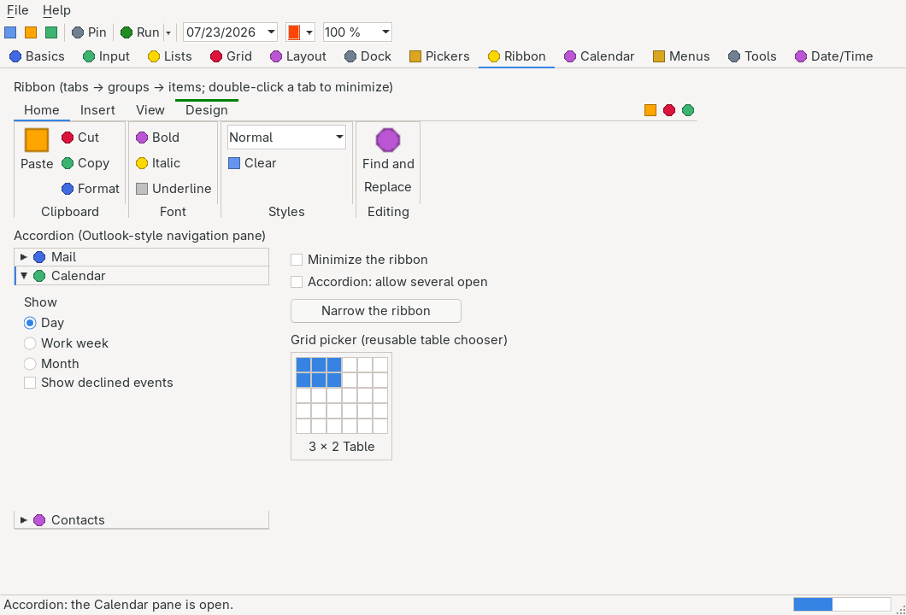

# Accordion / AccordionPane

> An Outlook-style navigation pane: a vertical stack of collapsible panes, each a themed header row —


> toggle glyph, optional icon, caption, hover feedback — over a body of real nested child controls.
> Headers stay put; the open panes share whatever height is left.

`Hawkynt.NativeForms.Accordion` · strategy: **owner-drawn** · peer: `ICanvasPeer`

## Usage

```csharp
var accordion = new Accordion { Bounds = new(10, 10, 240, 400) };

var mail = new AccordionPane("Mail");
mail.Controls.Add(new Button { Text = "Compose", Bounds = new(8, 8, 100, 26) });

var calendar = new AccordionPane("Calendar");
calendar.Controls.Add(new RadioButton { Text = "Week", Bounds = new(8, 8, 120, 20) });

accordion.Panes.AddRange(mail, calendar, new AccordionPane("Contacts"));
accordion.SelectedIndexChanged += (_, _) => Console.WriteLine(accordion.SelectedPane?.Text);
form.Controls.Add(accordion);
```

Header icons use the shared `ImageList` pattern — raw-ARGB images referenced per pane:

```csharp
var icons = new ImageList(16);          // 16×16 icons
mail.ImageIndex = icons.Add(iconArgb);  // int[] of width*height ARGB pixels
accordion.ImageList = icons;
```

Letting several panes stand open at once is one property:

```csharp
accordion.ExpandMode = AccordionExpandMode.Multiple;
```

## API

### Properties

| Property | Type | Default | Description |
|---|---|---|---|
| `Panes` | `AccordionPaneCollection` | empty | The panes, top to bottom. Adding parents the pane into `Controls`; the first pane added opens by itself. |
| `ExpandMode` | `AccordionExpandMode` | `Single` | Whether opening a pane closes the others. Switching back to `Single` folds down to the selected pane. |
| `ImageList` | `ImageList?` | `null` | The icons referenced by each pane's `ImageIndex` (or its `ImageKey` string; index wins). |
| `SelectedIndex` | `int` | `-1` | The open pane under `Single`, the most recently opened one otherwise; `-1` while none is open. Assigning expands that pane through the ordinary path, so `PaneExpanding` can still veto it. |
| `SelectedPane` | `AccordionPane?` | `null` | The current pane; setting expands it. |
| `HeaderHeight` | `int` (get) | theme row height | Pixel height of one header row. |

### Methods

| Method | Description |
|---|---|
| `GetHeaderBounds(int index)` | The client rectangle of a pane's header row, or `Rectangle.Empty` for an index outside the stack. Aiming a click at a header is otherwise guesswork, so tests and UI automation both need it. |

### Events

| Event | Description |
|---|---|
| `SelectedIndexChanged` | Raised after `SelectedIndex` changes. |
| `PaneExpanding` | Raised **before** a pane opens. Setting `Cancel` leaves the whole stack untouched — no sibling is collapsed on the cancelled pane's behalf. |
| `PaneExpanded` | Raised after a pane has opened and the stack has been laid out again. |
| `PaneCollapsed` | Raised after a pane has closed, including the pane `Single` mode closed to make room. |

`AccordionPaneCollection` is an `IReadOnlyList<AccordionPane>` with `Add`, `AddRange`, `Remove`,
`Clear` and `IndexOf`. Inherits the common members of [`Control`](control.md), plus the owner-drawn
surface of `OwnerDrawnControl` (`Invalidate`, `Focus`).

### AccordionPane

One pane: a [`Panel`](panel.md) whose inherited `Text` is the header caption and whose children are
the pane body. Constructors: `AccordionPane()` and `AccordionPane(string text)`.

| Property | Type | Default | Description |
|---|---|---|---|
| `Expanded` | `bool` | `false` | Whether the body is shown. Assigning routes through the owning `Accordion`, so the expand mode still applies and `PaneExpanding` can still veto. A detached pane just records the flag. |
| `ImageIndex` | `int` | `-1` | Index of this pane's icon in the owning `Accordion.ImageList`, `-1` for none. Painted between the toggle glyph and the caption. |

### AccordionExpandMode

| Value | Meaning |
|---|---|
| `Single` | Outlook-style: expanding a pane collapses every other one, so exactly one body is ever on screen. The default. |
| `Multiple` | Panes toggle independently; the open ones share the height the headers leave. |

## Notes

- Panes are real nested children — each realizes its own canvas peer, and its children realize as
  native peers inside it. The accordion owns every pane's bounds, so `Anchor`/`Dock` on a pane is
  ignored, exactly as a tab control ignores them on a page.
- Closing a pane vetoes its peer through the container seam rather than clearing the children's own
  `Visible` flags, so reopening restores precisely the body that was there — a child the caller had
  hidden itself stays hidden. While closed, those children read `Visible` as `false`, because that
  getter is effective and the body genuinely is not on screen.
- The veto lands on the pane, and the native widget nesting takes the rest of the subtree with it.
  A grandchild's own peer flag is left alone; it is the effective `Visible` that reports the truth at
  every depth. This is the same contract [`Expander`](expander.md) established.
- A pane on an unselected tab page stays off screen, and comes back with its page.
- Under `Single` a click on the already-open header is ignored — an Outlook stack never closes its
  last drawer that way. Under `Multiple` the same click closes it. Assigning `Expanded = false`
  always works.
- Keyboard (the control is focusable): Up/Down move the header focus, Home/End jump to the ends, and
  Enter or Space toggles the focused pane. The focused header carries a themed focus ring.
- Header captions are drawn straight into their row, so nothing on the pointer path measures text —
  hover feedback costs arithmetic only.
- Painted with the platform `ITheme` (`ControlBackground`, `HeaderBackground`, `Accent`, `Border`,
  `ControlText`, `SelectionText`, `DefaultFont`); testable headlessly through the test backend's
  recording canvas. A steady-state repaint allocates zero bytes.
- Complete per [docs/PRD.md](../PRD.md) §7.9 — no pending items.

## Differences from System.Windows.Forms

WinForms ships no accordion; the closest shapes are a stack of `Expander`-like group boxes or the
third-party Outlook-bar controls. Where this one deliberately differs from those conventions:

- **The panes are the layout.** There is no per-pane height: the open panes divide the space the
  headers leave. A single open pane therefore fills the control, which is what makes the stack look
  like a navigation pane rather than a list of boxes.
- **`Controls.Add` routes into `Panes`**, and adding a non-`AccordionPane` child throws
  `InvalidOperationException` — put content into a pane.
- **`PaneExpanding` is the only veto.** There is no `PaneCollapsing`; closing is never cancelable,
  because under `Single` a close is the side effect of somebody else opening.
