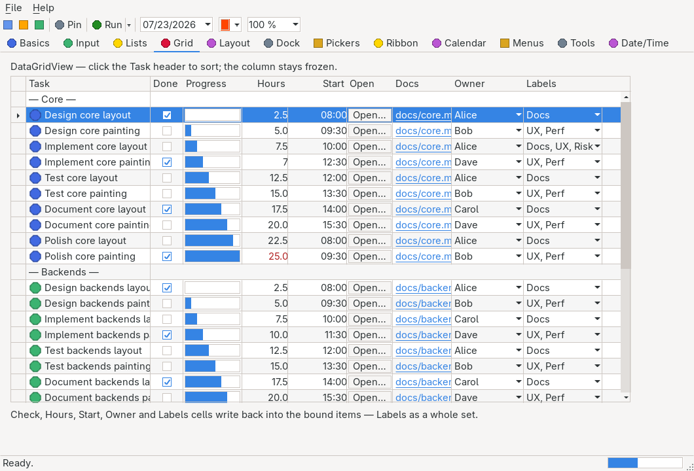

# DataGridView

> The flagship owner-drawn control: a vertically virtualized data grid whose rows are arbitrary


> objects and whose cells — text, masked text, check, button, link, multi-image, progress, combo,
> numeric, domain, date, color — are produced by reflection-free selector lambdas. Sorting and
> column order run over index indirections that never touch the model, cells edit in place through
> hosted editors, popups and dialogs, and millions of rows paint at constant per-row cost in the
> native theme.

`Hawkynt.NativeForms.DataGridView` · strategy: **owner-drawn** (native theme) · peer: `ICanvasPeer`

## Usage

```csharp
using Hawkynt.NativeForms;

var grid = new DataGridView { Bounds = new(0, 0, 200, 110) }; // 22 px header + 4 rows at 22 px
grid.Columns.Add(new DataGridViewColumn("Name", static o => ((Person)o!).Name)
{
    SortMode = DataGridViewColumnSortMode.Automatic,          // header click sorts
    TextSetter = static (o, value) => ((Person)o!).Name = value, // double-click/F2/typing edits in place
});
grid.Columns.Add(new DataGridViewColumn("Done", static _ => null)
{
    Kind = DataGridViewColumnKind.Check,
    Width = 60,
    CheckedSelector = static o => ((Person)o!).Done,
    CheckedSetter = static (o, value) => ((Person)o!).Done = value,
});

grid.Items.AddRange([new Person("Alice"), new Person("Bob")]);
grid.SelectionChanged += (_, _) => Console.WriteLine(grid.SelectedItem);

sealed class Person(string name) { public string Name = name; public bool Done; }
```

Everything a cell shows or writes goes through plain lambdas on the column — no property names, no
reflection, trim/NativeAOT-safe. One `DataGridViewColumn` class covers every kind; the kind-specific
selectors are simply unused by the other kinds.

## API

Inherits the common members of [`Control`](control.md).

### Properties

| Property | Type | Default | Description |
|---|---|---|---|
| `Columns` | `IList<DataGridViewColumn>` | empty | The columns shown. Mutate, then call `Invalidate()` to repaint. |
| `Items` | `ObservableList<object?>` | empty | The row items. Mutating the collection repaints the control. |
| `RowHeight` | `int` | theme row height | Pixel height of a data row. |
| `ColumnHeaderHeight` | `int` | `RowHeight` | Pixel height of the column-header row. |
| `ShowColumnHeaders` | `bool` | `true` | Whether the header row is painted. |
| `ShowRowHeaders` | `bool` | `false` | Whether a header column is painted at the left edge, with a marker triangle on the selected row. |
| `RowHeaderWidth` | `int` | `24` | Pixel width of the row-header column. |
| `ShowGridLines` | `bool` | `true` | Whether horizontal and vertical grid lines are painted. |
| `AlternatingRows` | `bool` | `false` | Whether every other data row (in display order) is tinted with `AlternatingRowColor`. |
| `AlternatingRowColor` | `Color` | `#F6F6F6` | Background tint of alternating rows. |
| `AllowUserToResizeColumns` | `bool` | `true` | Whether dragging a column divider in the header resizes that column (±3 px grab zone). |
| `AllowUserToOrderColumns` | `bool` | `false` | Whether dragging a header past a neighbor reorders the display by rewriting `DisplayIndex` — `Columns` keeps its model order. |
| `MultiSelect` | `bool` | `false` | Whether Ctrl (toggle) and Shift (display-order range) clicks and Shift+arrows select several rows at once. |
| `ReadOnly` | `bool` | `false` | Whether every cell in the grid refuses edits and check toggling (see `IsCellReadOnly`). |
| `FullRowTextSelector` | `Func<object?, string?>?` | `null` | Merges a row into one full-width cell: a non-`null` result paints that text across every column (a group/separator row), skipped by selection, navigation and editing. |
| `RowBackColorSelector` | `Func<object?, Color?>?` | `null` | Per-row background color; `null` result keeps the default. |
| `RowHeightSelector` | `Func<object?, int?>?` | `null` | Per-row pixel height; `null` result uses `RowHeight`. |
| `RowHiddenSelector` | `Func<object?, bool>?` | `null` | Hides rows; hidden rows are skipped by painting, hit-testing and navigation. |
| `RowSelectableSelector` | `Func<object?, bool>?` | `null` | Whether a row can be selected via mouse or keyboard; `null` means all. |
| `HorizontalOffset` | `int` | `0` | Horizontal scroll in pixels, clamped so the non-frozen columns never scroll past their width; frozen columns stay put. |
| `SelectedRowIndex` | `int` | `-1` | The selected row's `Items` index (`-1` for none) — the current row while `MultiSelect` holds a wider set. Stable under sorting; assigning collapses a multi-selection to the one row. |
| `SelectedItem` | `object?` | `null` | The selected row item; setting selects by `IndexOf`. |
| `SelectedItems` | `IEnumerable<object?>` (get) | empty | The selected items in model order: the whole Ctrl/Shift set under `MultiSelect`, otherwise the single row. |
| `CurrentColumnIndex` | `int` | `0` | The column keyboard activation (Space/Enter) and F2 target; follows the last clicked cell. |
| `TopRow` | `int` | `0` | Display index of the first visible data row (vertical scroll position). Settable — the value clamps into the scroll range; the vertical scrollbar thumb reads and writes it. |
| `EditMode` | `DataGridViewEditMode` | `EditOnKeystrokeOrF2` | How cells enter edit mode: keystroke/F2/double-click (default), `EditOnEnter` (a cell edits as soon as it becomes current), or `EditProgrammatically` (only `BeginEdit`). |
| `ShowCellToolTips` | `bool` | `true` | Whether resting the pointer on a cell whose column has a `TooltipSelector` pops that text up near the cursor. |
| `IsCurrentCellDirty` | `bool` (get) | `false` | Whether the hosted editor's content changed since the edit began; cleared when the edit ends. Popup kinds commit through their pick gesture and never report dirty. |
| `IsVerticalScrollBarVisible` / `IsHorizontalScrollBarVisible` | `bool` (get) | `false` | Whether the interactive scrollbar strips are currently shown (rows/columns overflow the viewport). |
| `SortedColumn` | `DataGridViewColumn?` (get) | `null` | The column the grid is currently sorted by. |
| `SortOrder` | `SortOrder` (get) | `None` | The active sort direction; `None` shows `Items` order. |
| `IsEditing` | `bool` (get) | `false` | Whether a cell is currently in edit mode. |
| `EditingControl` | `Control?` (get) | `null` | The hosted editor while a `Text`/`MaskedText`/`NumericUpDown`/`TimePicker`/`DomainUpDown` cell edits; popup and dialog kinds host no child control. |
| `DataSource` | `IEnumerable?` (set) | — | Clears `Items` and copies the sequence in (one-way snapshot, not a live view). |

### Events

All cell events carry **model indices** — `RowIndex` into `Items`, `ColumnIndex` into `Columns` — so
handlers stay stable while the grid is sorted or the columns are reordered.

| Event | Description |
|---|---|
| `SelectionChanged` | Raised when `SelectedRowIndex` (or the multi-selection set) changes. |
| `CellClick` | Raised when a data cell is clicked, and on Space/Enter for the current cell. |
| `CellDoubleClick` | Raised when a cell is clicked twice within 500 ms. |
| `CellContentClick` | Raised when the content of a check, button, link or multi-image cell is clicked; for multi-image cells `ContentIndex` names the icon (`-1` otherwise). |
| `CellBeginEdit` | Raised before a cell enters edit mode; set `Cancel` to keep it read. |
| `CellValidating` | Raised before an edit commits, carrying `ProposedValue` (typed by the column's kind: `string`, `decimal`, the chosen item, `DateTime`, or — for the set-valued kinds — the whole `IReadOnlyList<object?>` of picked items); set `Cancel` to veto the write and keep the cell in edit mode. |
| `CellValidating` | Raised before an edit commits, carrying `ProposedValue` (typed by the column's kind: `string`, `decimal`, `TimeSpan`, the chosen item, or `DateTime`); set `Cancel` to veto the write and keep the cell in edit mode. |
| `CellEndEdit` | Raised after a cell leaves edit mode, whether the edit committed or was cancelled. |
| `CellItemCheck` | Raised before an item's tick flips inside a `CheckedListBox` cell's popup — the grid-side sibling of `CheckedListBox.ItemCheck`, with the same veto shape (reset `NewValue` to `CurrentValue`). `Index` indexes the popup's item list; the cell is the one `SelectedRowIndex`/`CurrentColumnIndex` report while the popup is open. |
| `CurrentCellDirtyStateChanged` | Raised when `IsCurrentCellDirty` flips — on the first editor change after the edit begins, and again when the edit ends. |
| `RowValidating` | Raised before the current row is left for another one, carrying the row being left; set `Cancel` to keep the selection where it is. |
| `RowValidated` | Raised after the current row was left without a `RowValidating` veto. |
| `PasteCompleted` | Raised after `Paste` processed clipboard text — every attempted cell already ran its own `CellValidating`. |

### Methods

| Method | Description |
|---|---|
| `Sort(column, order)` | Sorts the presentation by the column and direction; `null`/`SortOrder.None` clears the sort. `Items` is never mutated. |
| `EnsureVisible(int rowIndex)` | Scrolls so the given data row (an `Items` index) is visible. |
| `IsCellReadOnly(rowItem, column)` | Whether the cell refuses edits and check toggling: read-only at any level (grid, column, or the column's per-cell predicate) wins, WinForms semantics. |
| `GetCellTooltip(rowIndex, columnIndex)` | The text the column's `TooltipSelector` yields for the cell, or `null` (also for out-of-range indices). |
| `BeginEdit(rowIndex, columnIndex)` | Puts the cell into edit mode; returns whether it did (see *Cell editing*). |
| `CommitEdit()` | Validates and writes the active edit; `false` means a `CellValidating` veto kept the cell editing. A no-op returning `true` while nothing edits. |
| `CancelEdit()` | Leaves edit mode without writing, still raising `CellEndEdit`. |
| `GetCellBounds(rowIndex, columnIndex)` | The client-space rectangle of a cell, honoring scroll, per-row heights, hidden rows, sorting and display order; `Rectangle.Empty` outside the visible window. |
| `GetClipboardContent()` | The selection as tab-separated text (see *Clipboard*). |
| `Paste(string text)` | Pastes tab-separated text starting at the current cell (see *Clipboard*); Ctrl+V feeds this from the system clipboard. |

### DataGridViewColumn

Constructor: `DataGridViewColumn(string headerText, Func<object?, object?> valueSelector)`.

Core members:

| Member | Type | Default | Description |
|---|---|---|---|
| `HeaderText` | `string` | ctor | Text painted in the column header. |
| `Kind` | `DataGridViewColumnKind` | `Text` | How the column renders and reacts to clicks (see *Column kinds*). |
| `Width` | `int` | `100` | Column width in pixels. |
| `MinimumWidth` | `int` | `8` | The narrowest width the column accepts (floored at 2 px): the lower bound of a divider drag and of a `Fill` column's share. |
| `FillWeight` | `float` | `100` | The column's share of the leftover viewport width under `AutoSizeMode.Fill`, relative to the other fill columns' weights. |
| `Resizable` | `DataGridViewTriState` | `NotSet` | Whether the user may drag this column's divider: `True`/`False` override the grid's `AllowUserToResizeColumns`; `NotSet` inherits it — WinForms semantics. |
| `Alignment` | `ContentAlignment` | `MiddleLeft` | Alignment of header and cell content. |
| `ValueSelector` | `Func<object?, object?>` | ctor | Maps a row item to the cell value, rendered via `ToString()`. |
| `ImageSelector` | `Func<object?, IImage?>?` | `null` | Optional per-cell icon before the text (text kinds); `null` result means none. |
| `FormatSelector` | `Func<object?, string>?` | `null` | Formats the `ValueSelector` result into display text — the reflection-free `CellFormatting` seam. Shapes the displayed text only (editors still seed from the raw value); the result is cached per cell until the row changes. |
| `DisplayTextSelector` | `Func<object?, string?>?` | `null` | Overrides the displayed cell text wholesale; `null` result falls back to `FormatSelector`/`ValueSelector`. |
| `CellStyleSelector` | `Func<object?, DataGridViewCellStyle>?` | `null` | Per-cell style overrides — a value type with optional `ForeColor`, `BackColor` and `Alignment`; unset members keep the column/theme default. |
| `TooltipSelector` | `Func<object?, string?>?` | `null` | Per-cell tooltip text, surfaced through `GetCellTooltip`. |
| `ReadOnly` | `bool` | `false` | Whether every cell in the column refuses edits and check toggling. |
| `ReadOnlyCellSelector` | `Func<object?, bool>?` | `null` | Per-cell read-only predicate over the row item. |
| `SortMode` | `DataGridViewColumnSortMode` | `NotSortable` | `Automatic` makes a header click toggle ascending/descending. |
| `SortComparison` | `Comparison<object?>?` | `null` | Row-item comparison used when this column sorts; `null` compares the `ValueSelector` values. |
| `AutoSizeMode` | `DataGridViewAutoSizeColumnMode` | `None` | `AllCells` fits the widest cell text in the visible row window, remeasured each paint; `Fill` shares the leftover viewport width with the other fill columns by `FillWeight`, floored at `MinimumWidth`. |
| `Frozen` | `bool` | `false` | Pins the column at the left edge: frozen columns form the leading display run and stay put while `HorizontalOffset` scrolls the rest underneath. |
| `DisplayIndex` | `int` | `-1` | The column's position in the display order (negative = its `Columns` position). Drag-reorder rewrites it on every column; `Columns` itself is never reordered. |

Kind-specific content and editing members:

| Member | Type | Used by | Description |
|---|---|---|---|
| `CheckedSelector` | `Func<object?, bool>?` | `Check` | The cell's check state; unset renders unchecked. |
| `CheckedSetter` | `Action<object?, bool>?` | `Check` | Writes the toggled state back on click unless the cell is read-only; `null` makes the glyph display-only. |
| `EnabledSelector` | `Func<object?, bool>?` | `Button` | Whether the button is enabled; `null` means always. Disabled buttons grey their text and raise no `CellContentClick`. |
| `ImagesSelector` | `Func<object?, IReadOnlyList<IImage>>?` | `MultiImage` | The icons painted side by side. Return a cached list — the selector runs on the paint path. |
| `ProgressSelector` | `Func<object?, int>?` | `Progress` | The 0..100 fill; out-of-range values clamp. |
| `TextSetter` | `Action<object?, string>?` | `Text` | Writes a committed edit back; `null` (the default) keeps the cell display-only. |
| `ItemsSelector` | `Func<object?, IReadOnlyList<object?>>?` | `ComboBox`, `DomainUpDown`, `ListBox`, `CheckedListBox` | The choices the popup (or spinner) offers. Return a cached list; required to enter edit mode. |
| `ItemDisplaySelector` | `Func<object?, string>?` | `ComboBox`, `DomainUpDown`, `ListBox`, `CheckedListBox` | A choice's display text in the popup. `null` falls back to `ToString()`. For the two list kinds it also shapes the closed cell's text, so writing it drops the cached display text. |
| `ValueSetter` | `Action<object?, object?>?` | `ComboBox`, `DomainUpDown`, single-select `ListBox` | Writes the picked choice back to the row item. |
| `SelectionMode` | `SelectionMode` | `ListBox` | `One` (default) makes the cell single-valued; `MultiSimple`/`MultiExtended` make it set-valued; `None` makes it display-only. Ignored by every other kind. |
| `CheckedItemsSelector` | `Func<object?, IReadOnlyList<object?>>?` | `CheckedListBox`, multi-select `ListBox` | The items currently in the cell's set. Their display texts, joined with `", "`, are the closed cell's text — cached per row, so this never runs on the paint path. |
| `CheckedItemsSetter` | `Action<object?, IReadOnlyList<object?>>?` | `CheckedListBox`, multi-select `ListBox` | Writes the whole picked set back. The grid hands over a freshly allocated array in `ItemsSelector` order and keeps no reference to it. |
| `NumberSelector` / `NumberSetter` | `Func<object?, decimal>?` / `Action<object?, decimal>?` | `NumericUpDown` | Seed and write-back of the hosted numeric editor; the written value is already clamped into [`Minimum`, `Maximum`]. |
| `Minimum` / `Maximum` / `Increment` / `DecimalPlaces` | `decimal` ×3, `int` | `NumericUpDown` | Editor range (0..100), spinner/arrow step (1) and displayed digits (0). |
| `DateSelector` / `DateSetter` | `Func<object?, DateTime>?` / `Action<object?, DateTime>?` | `DateTime` | Seed and write-back of the popup calendar; the picked day keeps the seed's time of day. |
| `TimeSelector` / `TimeSetter` | `Func<object?, TimeSpan>?` / `Action<object?, TimeSpan>?` | `TimePicker` | Seed and write-back of the hosted time editor; the written value is already inside [`MinTime`, `MaxTime`]. |
| `MinTime` / `MaxTime` / `ShowSeconds` / `Use24HourClock` | `TimeSpan` ×2, `bool` ×2 | `TimePicker` | Editor window (`00:00:00`..`23:59:59`) and layout (seconds shown, 24-hour clock). |
| `Mask` | `string` | `MaskedText` | The input mask the hosted [`MaskedTextBox`](maskedtextbox.md) editor forces; empty hosts a plain masked box. Commits through `TextSetter`. |
| `ColorSelector` / `ColorSetter` | `Func<object?, Color>?` / `Action<object?, Color>?` | `Color` | The swatch color and the write-back of the picked color; both are required for the cell to edit. |

### Column kinds

| `DataGridViewColumnKind` | Renders | Click / edit behavior |
|---|---|---|
| `Text` | `ValueSelector` text, optional `ImageSelector` icon before it | Edits in a hosted `TextBox` when `TextSetter` is set. |
| `Check` | Themed check glyph from `CheckedSelector` | Click raises `CellContentClick` and toggles through `CheckedSetter` unless read-only. |
| `Button` | Themed button face with the cell text | Click raises `CellContentClick` while `EnabledSelector` allows it. |
| `Link` | Accent-colored, underlined text | Click raises `CellContentClick`. |
| `MultiImage` | Icons from `ImagesSelector` side by side | Each icon hit-tests individually; the index arrives in `ContentIndex`. Clicks between or past icons raise nothing. |
| `Progress` | Themed 0..100 fill from `ProgressSelector` | Display-only. |
| `ComboBox` | The value text plus a drop arrow | Edits in a popup choice list; the pick commits through `ValueSetter`. |
| `NumericUpDown` | The value as text | Edits in a hosted `NumericUpDown` clamped and stepped by the column. |
| `DateTime` | The formatted date as text | Edits in the popup month calendar (the `DateTimePicker` engine, title drill-down included); the pick commits through `DateSetter`. |
| `TimePicker` | The formatted time of day as text | Edits in a hosted [`TimePicker`](timepicker.md) over the cell; Up/Down step the part under its caret, Left/Right move that caret, Enter commits through `TimeSetter`. |
| `MaskedText` | The value text | Edits in a hosted [`MaskedTextBox`](maskedtextbox.md) forcing the column's `Mask`; commits through `TextSetter`. |
| `DomainUpDown` | The value as text | Edits in a hosted [`DomainUpDown`](domainupdown.md) over `ItemsSelector`'s choices; commits through `ValueSetter`. |
| `Color` | A color swatch from `ColorSelector` | Edits through the platform's modal color dialog; the pick commits through `ColorSetter`, cancel writes nothing. |
| `ListBox` | The picked value — or, when `SelectionMode` admits several, the comma-joined summary of the picked set — plus a drop arrow | Edits in a taller, scrollable popup list. A single-select cell commits the clicked row through `ValueSetter` at once; a multi-select one gathers the picks and commits them as a whole set through `CheckedItemsSetter`. |
| `CheckedListBox` | The comma-joined summary of `CheckedItemsSelector`'s items, plus a drop arrow | Edits in a popup checked list; every tick runs the vetoable `CellItemCheck`, and the whole set commits through `CheckedItemsSetter`. |

## Notes

### Virtualization

Painting, hit-testing and the presentation selectors walk linearly over the visible row window only
— the grid holds no cell objects, no row views and no cached layout, so its own memory stays
constant regardless of row count. The test suite bounds it: 100 000 rows paint fewer than 32 text
operations, with the row-hidden/height/color selectors active. The sort map is the one O(n)
allocation and exists only while a sort is active; the scroll range under per-row heights is
approximated from the default `RowHeight`.

### Binding and the model-index contract

Rows are plain objects in an `ObservableList<object?>`; mutations repaint, clamp selection and
scroll, re-sort lazily and commit-or-cancel an edit whose row vanished. `DataSource` is a set-only
snapshot. Binding is one-way for display — the write path is explicit, through the column setters
(`TextSetter`, `CheckedSetter`, `ValueSetter`, `NumberSetter`, `DateSetter`). Everything public
speaks model indices: `SelectedRowIndex`, all cell events and `BeginEdit`/`GetCellBounds` refer to
`Items`/`Columns` positions, unaffected by sorting or column reorder. Only `TopRow` is a display
index.

### Sorting

A click on a header whose `SortMode` is `Automatic` sorts ascending, a second click descending; the
sorted header paints a themed arrow. Sorting reorders a display→model index map — `Items` keeps
insertion order, selection follows the item, keyboard navigation follows the display order. Ties
keep model order. The map is rebuilt lazily after item changes, before the next paint. Rows compare
via `SortComparison` when set, else via the `ValueSelector` values (`IComparable` when both sides
are the same type, ordinal strings otherwise). `Sort(null, SortOrder.None)` restores `Items` order.

### Selection

Full-row: a click below the header selects (clicks inside the header sort/resize/reorder instead),
subject to `RowSelectableSelector`; merged rows take no selection. With `MultiSelect`, Ctrl+click
toggles a row in the set, Shift+click selects the display-order range from the anchor (skipping
hidden, unselectable and merged rows), a plain click collapses to the clicked row, and Shift+arrow
extends the range; `SelectedRowIndex` stays the current row, `SelectedItems` enumerates the set in
model order. With `ShowRowHeaders`, a click on the row-header strip selects the row without raising
`CellClick`.

### Read-only

Three levels — grid `ReadOnly`, column `ReadOnly`, per-cell `ReadOnlyCellSelector` — and any level
wins. Read-only blocks editing and check toggling; `CellContentClick` still fires, so a handler can
react to the click without the state changing.

### Presentation selectors

Per row: `RowBackColorSelector` (selection wins over it, it wins over `AlternatingRows`),
`RowHeightSelector`, `RowHiddenSelector`, `RowSelectableSelector`. Per cell:
`CellStyleSelector`, `DisplayTextSelector`, `TooltipSelector`. `FullRowTextSelector` turns a row
into a group/separator: one full-width text cell, no per-column cells, no vertical grid lines
through it, skipped by selection, keyboard navigation and editing. All of these run on the paint
path — return cached values and capture nothing.

### Cell editing

`BeginEdit` hosts a `TextBox` (`Text`), `MaskedTextBox` (`MaskedText`), `NumericUpDown` or
`DomainUpDown` over the cell, floats a popup below it — the choice list of a `ComboBox` cell, the
taller list of a `ListBox` or `CheckedListBox` cell, the month calendar of a `DateTime` cell — or
opens the platform's modal color dialog (`Color`). It
`BeginEdit` hosts a `TextBox` (`Text`), `MaskedTextBox` (`MaskedText`), `NumericUpDown`,
`TimePicker` or `DomainUpDown` over the cell, floats a popup below it — the choice list of a `ComboBox` cell, the
month calendar of a `DateTime` cell — or opens the platform's modal color dialog (`Color`). It
refuses (returning `false`) for read-only cells, kinds whose edit selectors/setters are unset (a
`Text` column without `TextSetter` is display-only), merged or hidden rows, cells outside the
visible window, a `CellBeginEdit` veto, or popup/dialog kinds before realization. An edit already
active on another cell is committed first; its validation veto also refuses the new edit. Entry
gestures follow `EditMode`: with the default `EditOnKeystrokeOrF2` a double-click, F2 on the current
cell, or typing a character (text/numeric kinds; the character seeds the editor) begins the edit — a
`TimePicker` cell has no text to seed, so a double-click or F2 opens it;
`EditOnEnter` additionally edits a cell the moment it becomes current; `EditProgrammatically`
ignores every gesture. While an edit is open, the first editor change flips `IsCurrentCellDirty`
(raising `CurrentCellDirtyStateChanged`); the flag clears when the edit ends.

A hosted native editor cannot preview keys yet, so edits commit at the honest points available:
Enter on the grid surface (Escape cancels), a press on the grid outside the editor (click-away —
commit first, then the click), the edited row scrolling out of the visible window (commit, matching
the classic grid; a validation veto abandons instead so scrolling never wedges), and explicit
`CommitEdit`/`CancelEdit`. The popup kinds commit through their own pick gestures — clicking or
Enter on a combo choice, picking a day in the calendar — and light dismissal cancels. Every commit
runs `CellValidating` first; a veto keeps the cell (or popup) editing and writes nothing.
`CellEndEdit` always closes the cycle. While a cell edits, the keyboard belongs to the edit; the
hosted editor's bounds follow the cell under scroll and resize.

The two set-valued kinds — `CheckedListBox`, and `ListBox` under `MultiSimple`/`MultiExtended` —
accumulate their ticks in the popup and write nothing until the edit ends: **Enter commits the whole
set, and light dismissal (Escape, a click outside) abandons it**, like every other popup kind.
Committing on dismissal would read better for a mouse-only user, but the backends disagree on what
dismissal is — a popup surface swallows Escape at its own top-level on some of them and routes it to
the grid on others — so it would make Escape save the edit on one platform and abandon it on the
next. Inside the popup a click toggles an item under `CheckedListBox` and `MultiSimple`;
under `MultiExtended` a plain click replaces the picked set, Ctrl+click toggles and Shift+click
picks the run from the anchor — the `ListBox` control's own gestures. Space toggles the row under
the caret, Up/Down move it. The committed value is a freshly allocated `IReadOnlyList<object?>`
holding the picked items in `ItemsSelector` order; the grid keeps no reference to it, so the setter
may store it as-is. A single-select `ListBox` cell behaves exactly like a `ComboBox` one: the click
commits at once and dismissal cancels.

Row-level validation piggybacks on the current row: leaving it for another one raises the vetoable
`RowValidating` (a `Cancel` keeps the selection where it is), then `RowValidated` once the move
committed.

### Columns: resize, auto-size, frozen, reorder

Dragging a header divider resizes down to a minimum of 8 px (`AllowUserToResizeColumns` disables
it). `AutoSizeMode.AllCells` fits the widest visible cell text (plus icon and padding), remeasured
each paint — deliberately window-scoped, so the width may adapt as the grid scrolls. Frozen columns
form the leading run of the display order and stay pinned while the rest scroll underneath, sealed
by a seam line; `HorizontalOffset` clamps against the scrolling columns only, and hit-testing gives
the pinned run priority over columns scrolled beneath it. With `AllowUserToOrderColumns`, dragging a
header past a neighbor reorders the display by rewriting every column's `DisplayIndex` — the drag
never crosses the frozen boundary, and the model `Columns` list is never touched.

### Scrolling

When the rows or columns overflow the viewport, the grid paints interactive themed scrollbar strips
(`IsVerticalScrollBarVisible`/`IsHorizontalScrollBarVisible`): the arrows step, a channel click
pages, and dragging a thumb scrubs `TopRow` (vertical) or `HorizontalOffset` (horizontal) live —
the shared `ScrollBarRenderer` geometry, so they match the standalone
[scrollbars](scrollbar.md). The wheel scrolls three rows per notch (selection untouched);
Shift+wheel scrolls horizontally by 30 px per notch, clamped. `TopRow` is settable for programmatic
vertical scrolling; `EnsureVisible` targets a row.

### Keyboard and clipboard

Up/Down move the selection by one display row, PageUp/PageDown by one visible page, Home/End to the
edges — always skipping hidden, unselectable and merged rows; Shift extends under `MultiSelect`.
Space/Enter raise `CellClick` on the current cell, F2 edits it, printable characters start a text or
numeric edit.

Copy and paste round-trip the set-valued kinds through the same summary the cell shows: `Paste`
splits the text on commas, trims each piece and maps it onto a choice, writing the whole set at
once. One unrecognised piece fails the cell, so a partial set is never written.

`GetClipboardContent()` renders the selection as text: one line per selected row in display order,
the cells in display column order through the usual display selectors, joined with tabs; merged
rows contribute their full-row text as the whole line; empty without a selection. Ctrl+C puts
exactly this on the system clipboard through the backend.

`Paste(string)` is the reverse — the Excel-style block paste every WinForms grid hand-rolls: lines
map onto display rows from the current row downward (skipping hidden, unselectable and merged
rows), tab-separated cells onto display columns from the current column rightward; content past the
last row or column is dropped. Each target cell converts its text to the column kind's value and
writes through that kind's setter (a `TimePicker` cell parses invariant `hh:mm[:ss]` and rejects
anything outside [`MinTime`, `MaxTime`]) — read-only cells, display-only columns and unparseable
text are skipped, their position still consumed, and every write runs `CellValidating` first (a veto skips
that one cell). `PasteCompleted` closes the operation. Ctrl+V feeds it from the system clipboard.

### Theming

Header band and row headers in the theme's header colors, data rows over field background with
selection background/text, grid lines in the grid-line color, sort arrows and the row marker in
header text color, links and progress fills in the accent color. `AlternatingRows` tints odd
display rows.

**Not yet implemented** (per `docs/PRD.md` §7.4): DPI + dark mode polish.

## Differences from System.Windows.Forms.DataGridView

The grid keeps the WinForms *shape* — columns, cell events, in-place editing, header sort — but its
data model is deliberately different, in service of trim-safety and constant memory:

- **No `Rows` collection, no cell objects.** Rows are your own objects in `Items`
  (`ObservableList<object?>`); every cell reads and writes through the column's selector/setter
  lambdas. There are no `DataGridViewRow`/`DataGridViewCell` instances to index, style or tag.
- **No `CurrentCell` object.** The current position is the pair `SelectedRowIndex` (model index
  into `Items`) + `CurrentColumnIndex` (model index into `Columns`).
- **The edit pipeline is `CellValidating` → column setter → `CellEndEdit`.** There is no
  `CellValueChanged` (the setter *is* the value change — react there) and no `CellParsing`
  (conversion is the column kind's job); `CellFormatting` exists as the `FormatSelector` lambda,
  not an event.
- **Selection is full-row only.** The grid has no `SelectionMode` and no cell/column selection —
  `DataGridViewColumn.SelectionMode` is unrelated: it governs how a `ListBox` cell's *popup* picks.
  `MultiSelect` defaults to `false` (WinForms: `true`), and the selection readout is
  `SelectedItem`/`SelectedItems` — no `SelectedRows`/`SelectedCells` collections.
- **No new-row placeholder.** `AllowUserToAddRows`/`AllowUserToDeleteRows` and the `*` row do not
  exist — mutate `Items` instead.
- **Virtualization is paint-only and always on.** Only the visible row window is painted and
  measured, whatever the row count — so there is no `VirtualMode` and no `CellValueNeeded`; the
  selectors already are the on-demand value source.
- **No `EditingControlShowing`.** The active hosted editor is exposed directly through the
  `EditingControl` property.
- **`SortMode` defaults to `NotSortable`** (WinForms text columns: `Automatic`) — opt each sortable column in.
  Sorting reorders a display map; `Items` is never mutated (unlike WinForms' bound-list sort).
- **Cell clicks land on mouse-down**, not mouse-up: selection, `CellClick` and `CellContentClick`
  fire on the press.
- **Naming**: `GetCellBounds` (WinForms: `GetCellDisplayRectangle`), `TopRow` (WinForms:
  `FirstDisplayedScrollingRowIndex`), `ShowColumnHeaders`/`ShowRowHeaders` (WinForms:
  `ColumnHeadersVisible`/`RowHeadersVisible`); all cell events carry model indices.
