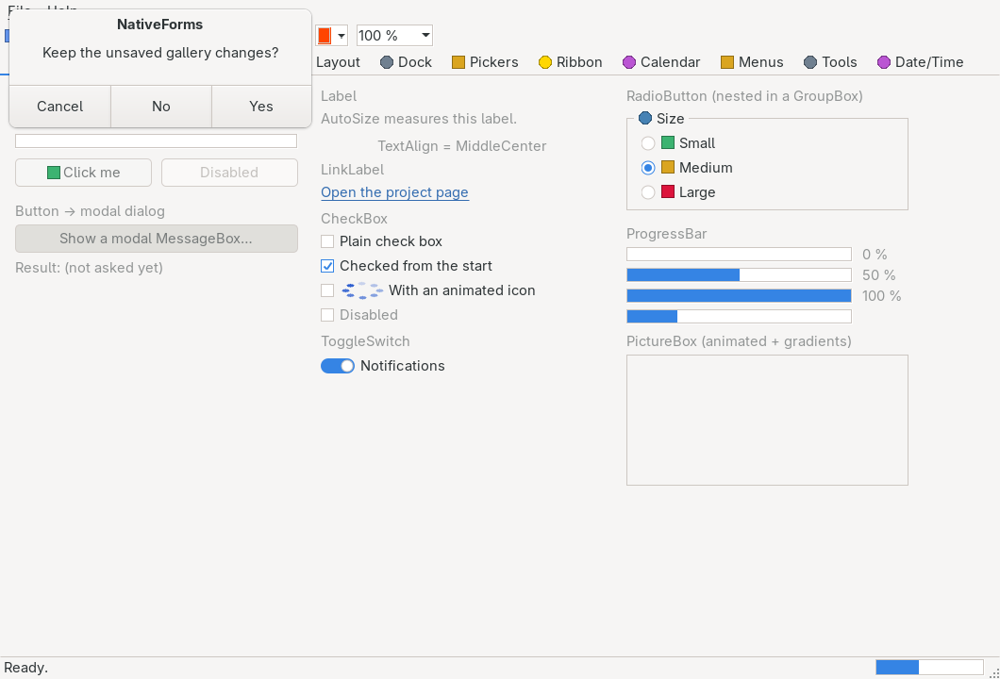

# Dialogs

> The native common dialogs — `MessageBox`, `OpenFileDialog`/`SaveFileDialog`, `FolderBrowserDialog`, `ColorDialog`, `FontDialog` — plus the `DialogResult` verdict and modal `Form.ShowDialog`. Each dialog object is a thin option holder; `ShowDialog` hands the options to the running backend, which presents the platform's own dialog application-modal and blocks until it closes.



`Hawkynt.NativeForms.MessageBox` (static) · `CommonDialog` subclasses · strategy: **native** (`MessageBoxW`/`GetOpenFileNameW` family/`SHBrowseForFolderW`/`ChooseColorW`/`ChooseFontW` on Win32; `GtkMessageDialog`/`GtkFileChooserDialog`/GTK choosers on Linux)

## Usage

```csharp
if (MessageBox.Show("Save changes?", "Editor", MessageBoxButtons.YesNoCancel, MessageBoxIcon.Question) == DialogResult.Yes)
{
    var save = new SaveFileDialog { Filter = "Text files|*.txt|All files|*.*", FileName = "notes.txt" };
    if (save.ShowDialog() == DialogResult.OK)
        File.WriteAllText(save.FileName, text);
}
```

All of this must run on the UI thread from inside `Application.Run` — without a running backend every `Show`/`ShowDialog` throws `InvalidOperationException`.

## DialogResult

The verdict a dialog returns. The numeric values match both `System.Windows.Forms.DialogResult` and the Win32 `MessageBox` return ids (`IDOK` … `IDNO`), so the Win32 backend maps by cast: `None` 0, `OK` 1, `Cancel` 2, `Abort` 3, `Retry` 4, `Ignore` 5, `Yes` 6, `No` 7.

## MessageBox

`MessageBox.Show(text[, caption[, buttons[, icon]]])` — and the owner-form overloads `Show(owner, text[, caption[, buttons[, icon]]])`, which parent the box to that window — shows the platform's native message box and returns the pressed button as a `DialogResult`. `MessageBoxButtons` (`OK`, `OKCancel`, `AbortRetryIgnore`, `YesNoCancel`, `YesNo`, `RetryCancel`) and `MessageBoxIcon` (`None`, `Error`, `Question`, `Warning`, `Information`) match the WinForms enums and the Win32 `MB_*` flags numerically. Null text or caption is treated as empty. Closing a GTK message dialog through the window manager instead of a button maps to the mildest available verdict: OK-only reports `OK` (as Win32 does), `YesNo` reports `No`, `AbortRetryIgnore` reports `Ignore`, the rest `Cancel`. `MessageBoxTests` pin the forwarding of every button set and the scripted result round-trip.

## File dialogs

`OpenFileDialog` and `SaveFileDialog` share the `FileDialog` base:

| Name | Type | Default | Description |
|---|---|---|---|
| `FileName` | `string` | `""` | The selected absolute path after OK; pre-fills the dialog's name box before. Cancel leaves it untouched. |
| `Filter` | `string` | `""` | The type filter in WinForms syntax (below). Empty shows every file. |
| `FilterIndex` | `int` | `1` | The 1-based index of the initially selected filter entry, as in WinForms. |
| `InitialDirectory` | `string` | `""` | The directory the dialog starts in; empty picks the platform default. |
| `Title` | `string` | `""` | The title-bar caption; empty picks the platform default. |

`OpenFileDialog` adds `Multiselect` (`bool`, default `false`) and read-only `FileNames` (`string[]`, all selected paths after OK — one element unless `Multiselect`; `FileName` is always the first). `SaveFileDialog` prompts before overwriting an existing file.

**Filter syntax**: display texts and glob patterns alternate around `'|'` — `"Text files|*.txt|All files|*.*"`; several patterns per entry separate with `';'` (`"*.txt;*.log"`). The setter validates eagerly: an odd number of segments throws `ArgumentException` at assignment, not at show time.

## FolderBrowserDialog

`SelectedPath` (default `""`) seeds the initial location and carries the chosen directory after `DialogResult.OK`; `Title` as above. Cancel keeps the previous path.

## ColorDialog / FontDialog

`ColorDialog.Color` (default `Color.Black`) and `FontDialog.Font` (default the theme's `DefaultFont`) seed the initial selection and carry the choice after `DialogResult.OK`; Cancel keeps the previous value. The GTK font chooser round-trips through Pango.

## Modal forms: Form.ShowDialog

Any [`Form`](form.md) runs modally via `ShowDialog(Form? owner = null)`: the form realizes, shows application-modal (disabling/parenting to the owner's window when given) and blocks in a nested native loop until it closes. The WinForms contract holds:

- Setting `Form.DialogResult` to anything but `None` while modal closes the dialog with that result; closing without one yields `Cancel`.
- A click on a `Button` with a non-`None` `Button.DialogResult` walks up to its owning form — however deep in the container tree — sets the result and closes; outside a modal loop it only sets `Form.DialogResult`.
- Assigning `Form.CancelButton` defaults that button's `DialogResult` to `Cancel` when it still has none; Enter/Escape click `AcceptButton`/`CancelButton` through the form's dialog-key chain, fed by focused owner-drawn controls (see [form.md](form.md)).
- The form unrealizes on close (`FormClosed` fires, the peer is disposed) and can be shown again; calling `ShowDialog` while already modal throws `InvalidOperationException`.

`ModalTests` pin all of the above; `DialogTests` pin the option forwarding, filter parsing/validation, OK/Cancel round-trips of every common dialog and the no-backend exception.

## Notes

- Common dialogs are not controls: nothing realizes, there is no peer to keep — construct, set options, `ShowDialog()`, read the properties back after `OK`.
- Per [docs/PRD.md](../PRD.md) §7.8: `MessageBox`, `ColorDialog` and `FontDialog` are done; the file dialogs pend `FilterIndex` write-back, the folder browser pends the Win32 initial-directory hook.

## Differences from System.Windows.Forms

- **No `MessageBoxDefaultButton`** — the platform's own default-button convention applies (typically the first/affirmative button); there are no `MessageBoxOptions` either.
- **File dialogs carry the core option set only**: no `DefaultExt`, `AddExtension`, `CheckFileExists`/`CheckPathExists`, `RestoreDirectory`, `ValidateNames` or `OverwritePrompt` toggle (`SaveFileDialog` always prompts before overwriting) — the platform dialog's own behavior stands in for the missing knobs.
- `ColorDialog`/`FontDialog` are seed-and-read only: no `AllowFullOpen`/`CustomColors`, no `ShowEffects`/`MinSize`/`MaxSize`.
- On GTK, closing a message box via the window manager maps to the mildest verdict of its button set (see above) — Win32 disables the close box in the same situations instead.
