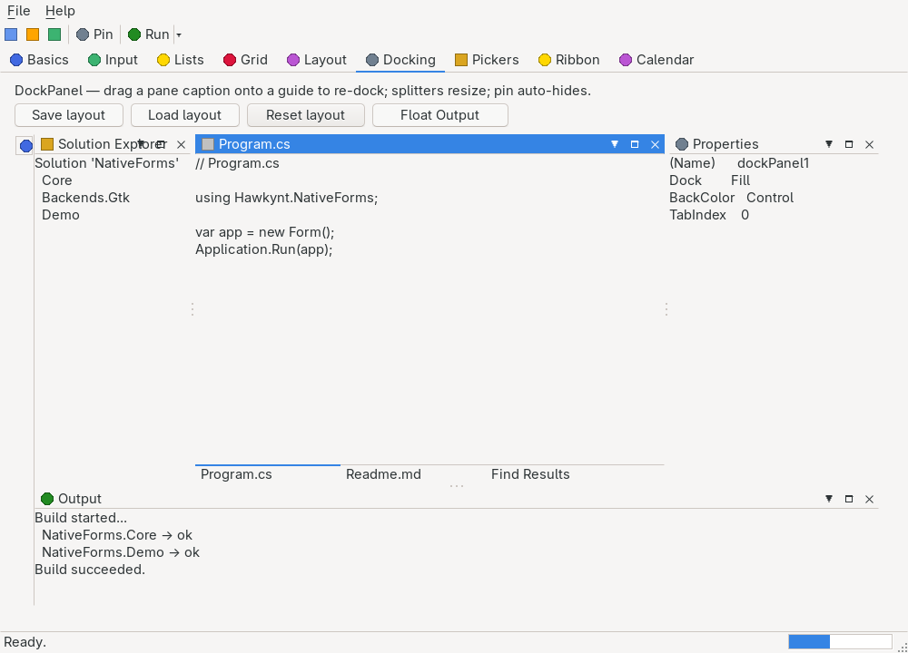

# DockPanel / DockContent

> A Visual-Studio-style docking manager: a container that hosts movable, dockable panes around a


> central document tab well. Panes dock to an edge, tab together, split apart with draggable splitters,
> tear off into floating windows, or collapse to auto-hide strips that fly out on hover. Dragging a
> pane caption raises docking overlay guides with a translucent landing preview; the whole arrangement
> round-trips through a compact save/load string.

`Hawkynt.NativeForms.DockPanel` · strategy: **owner-drawn** · peer: `ICanvasPeer`

## Usage

```csharp
var dock = new DockPanel { Bounds = new(0, 0, 900, 600), ImageList = icons };

// A central document well (open "files").
var editor = new DockContent("Program.cs") { Name = "doc.program", ImageIndex = _file };
editor.Controls.Add(new TextBox { Dock = DockStyle.Fill, Multiline = true });
dock.AddDocument(editor);

// Tool windows docked around the edges.
var solution = new DockContent("Solution Explorer") { Name = "tool.solution" };
solution.Controls.Add(new TreeView { Dock = DockStyle.Fill });
dock.Add(solution, DockState.Docked, DockEdge.Left);

dock.Add(new DockContent("Properties") { Name = "tool.props" }, DockState.Docked, DockEdge.Right);
dock.Add(new DockContent("Output")     { Name = "tool.out"   }, DockState.Docked, DockEdge.Bottom);

// A pane that collapses to an edge strip, and one that opens in its own window.
dock.Add(new DockContent("Toolbox") { Name = "tool.box" }, DockState.AutoHide, DockEdge.Left);
someContent.Float();

form.Controls.Add(dock);
```

Each `DockContent` is an ordinary container — its `Controls` hold real nested children that realize as
native peers — with a caption bar the manager paints (title, optional icon, close/float/auto-hide
buttons). The manager owns every caption, tab strip, splitter and edge strip, so the whole layout is
drawn and hit-tested in one place and a hidden or collapsed pane costs nothing.

## The state model

A pane's location is a `DockState`, with the clung-to edge carried separately by
`DockContent.DockEdge` (meaningful for `Docked` and `AutoHide`):

| `DockState` | Meaning |
|---|---|
| `Hidden` | Owned but shown nowhere — no caption, no tab, no strip. Its peer is vetoed, so it costs nothing. |
| `Docked` | Pinned to an edge, sharing a tab well with any siblings on the same edge, split from the rest by a draggable splitter. |
| `Document` | In the central document tab well — the editor area several documents share. |
| `Floating` | In its own top-level window, draggable and independent of the panel. Closing the window re-docks the pane. |
| `AutoHide` | Collapsed to a labelled strip on its edge; hovering or clicking the strip flies the pane out over the content, and it collapses again on an outside click or `Esc`. |

Assigning `DockContent.DockState` (or calling `Close`/`Float`/`ToggleAutoHide`/`Activate`) routes
through the owning `DockPanel`, which is the single writer of pane placement, so the layout tree,
z-order and persistence stay consistent. Only the panes actually on screen (docked or in the document
well) live in the manager's layout tree — a lazily built tree of splitter regions whose leaves are tab
groups; floating, auto-hidden and hidden panes live in side lists and cost the tree nothing.

## Drag docking — the overlay guides

Pressing a pane's caption (or one of its tabs) and dragging starts an in-place drag. The manager raises
a transient overlay surface — created only for the drag, torn down on drop, so nothing is allocated at
rest — that paints, over a light scrim:

- a **five-way guide diamond** centred on the region under the pointer (dock **left / top / right /
  bottom** of that region, or **centre** to add the pane as a new tab), plus four **panel-edge guides**
  for docking against the whole panel's outer edge; and
- a **translucent preview rectangle** of exactly where the pane will land.

Dropping performs the dock: a directional guide splits the target region (or the whole panel) and
inserts the pane with a fresh splitter; the centre guide tabs the pane into the target group. A pane
dragged out and dropped on a guide re-docks; releasing on no guide (or pressing `Esc`) cancels.

Adjacent regions are separated by draggable splitters (the band shows the sizing cursor and resizes
live). `Ctrl+Tab` / `Ctrl+Shift+Tab` cycle the document well; the caption buttons close, float and
pin (auto-hide) the active pane.

## Persistence

`SaveLayout()` serialises the whole arrangement — the split tree, every pane's state/edge/active flag
and the floating windows' bounds — to a compact, reflection-free string;
`LoadLayout(layout, key => content)` restores it, resolving each pane by its key (`PersistId`, else
`Name`). A key the resolver cannot map is skipped and a malformed token collapses to nothing, so an
older or partial layout still loads.

```csharp
var saved = dock.SaveLayout();          // "NFDOCK1|S(V,250,G(0,0,tool.solution),G(1,0,doc.program))|A(L:tool.box)|F()"
// … rearrange …
dock.LoadLayout(saved, key => panesByKey.GetValueOrDefault(key));
```

The format is `NFDOCK1|<tree>|<auto-hide>|<floating>`: the tree is a bracketed grammar of
`S(orient,ratio,child,child)` splits and `G(isDocument,active,key,…)` tab groups; the auto-hide section
is `A(edge:key,…)` and the floating section `F(key@x@y@w@h,…)`. Pane keys are percent-escaped so they
may hold any character.

## API

### `DockPanel`

| Member | Description |
|---|---|
| `Add(content, state = Document, edge = Left)` | Adds a pane in the given state. |
| `AddDocument(content)` | Adds a pane to the central document well. |
| `DockToEdge(content, edge)` | Docks a pane to an edge, joining any existing group there. |
| `Contents` | `IReadOnlyList<DockContent>` — every owned pane. |
| `ActiveContent` / `ActiveContentChanged` | The pane with the active caption. |
| `ImageList` | The icons `DockContent.ImageIndex` (or `ImageKey`) index into. |
| `DocumentTabStripEdge` | `TabAlignment` (default `Bottom`) — which edge each tab group's tab strip sits on. `Top`/`Bottom` lay the tabs in a horizontal row; `Left`/`Right` stack them in a vertical strip sized to the widest caption. |
| `SaveLayout()` / `LoadLayout(string, Func<string,DockContent?>)` | Reflection-free layout round-trip. |

### `DockContent`

| Member | Description |
|---|---|
| `Title` | Caption text (an alias for `Text`). |
| `ImageIndex` | Icon index into `DockPanel.ImageList`, or `-1`. |
| `DockState` / `DockEdge` | Where the pane lives; assigning moves it. |
| `PersistId` | Stable key for save/load (defaults to `Name`). |
| `AllowClose` / `AllowFloat` / `AllowAutoHide` | Which caption buttons the pane shows. |
| `Close()` / `Float()` / `ToggleAutoHide()` / `Activate()` | State transitions (routed through the manager). |
| `DockStateChanged` | Raised after the state changes. |
| `CloseRequested` | Vetoable (`CancelEventArgs`) close pipeline. |

## Differences from WinForms

WinForms ships no docking manager — this mirrors the widely used *DockPanel Suite* rather than a
`System.Windows.Forms` type. The state model is deliberately split into `DockState` +
`DockEdge` (rather than DockPanel Suite's flattened enum). Cross-window drag of a floating pane back
onto a guide is not offered: a floating pane re-docks by closing its window or assigning `DockState`.
Docked-pane *edges* inside nested splits are not persisted (the tree geometry is), because an edge is
ambiguous once a pane lives several splits deep; auto-hide edges **are** persisted.

## Memory & paint

An empty `DockPanel` measures **≈544 B**, an empty `DockContent` **≈368 B** (both inside the 768 B
owner-drawn budget). A populated layout — several docked panes, a document tab well and two splitters —
repaints with **zero** managed allocation in steady state; the drag overlay allocates only while a drag
is in flight, and is disposed on drop.
