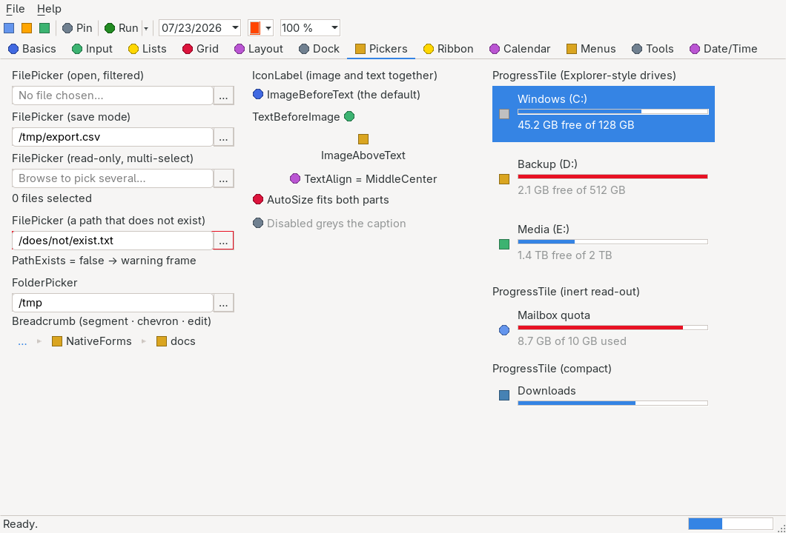

# FolderPicker

> A folder field: a hosted native [`TextBox`](textbox.md) holding the directory plus a browse button that opens the platform's own [`FolderBrowserDialog`](dialogs.md) and writes the choice back.



`Hawkynt.NativeForms.FolderPicker` · strategy: **owner-drawn** (frame over a hosted native `TextBox`) · peer: `ICanvasPeer` + `ITextBoxPeer`

## Usage

```csharp
var picker = new FolderPicker
{
    Bounds = new(20, 20, 300, 26),
    SelectedPath = "/tmp",
    Title = "Pick an output folder",
};
picker.PathChanged += (_, _) => SetOutputDirectory(picker.SelectedPath);
form.Controls.Add(picker);
```

## API

### Properties

| Name | Type | Default | Description |
|---|---|---|---|
| `SelectedPath` | `string` | `""` | The committed directory. Assigning rewrites the editor, re-evaluates `PathExists` and raises `PathChanged`. It also seeds the dialog's start location. |
| `Title` | `string` | `""` | The dialog's caption; empty picks the platform default. |
| `ReadOnlyText` | `bool` | `false` | Makes the field display-only — still selectable and copyable, but only the browse button changes it. |
| `PathExists` | `bool` | `false` | Whether the committed directory was real when last evaluated. See Notes. |
| `PlaceholderText` | `string` | `""` | Greyed hint shown while the field is empty. |

The inherited `Text` is the hosted editor's *live* content, including an edit not committed yet.

### Events

| Name | Description |
|---|---|
| `PathChanged` | Raised after `SelectedPath` changed, however it was committed. |

### Methods

| Name | Description |
|---|---|
| `PerformBrowse()` | Opens the browse dialog exactly as a click on the button would, and commits an OK. |

Inherits the common members of [`Control`](control.md) plus the owner-drawn surface of `OwnerDrawnControl`.

## Notes

- Shares its whole engine with [`FilePicker`](filepicker.md) — the hosted editor, the themed `…` browse button, the commit points and the warning frame are the same code; only the dialog and the existence question differ. See that page for the committed-path-vs-live-text model, which applies here unchanged.
- **`PathExists` asks about a directory, not a file.** A path that names an existing *file* reports `false`, because it is not a folder.
- **The committed value is a directory** — the mirror of [`FilePicker`](filepicker.md)'s Open-mode contract. A folder is exactly what this picker stands behind, so an existing directory is *accepted*, never refused; nothing here vetoes a commit. Use `FilePicker` when a file is the wanted value.
- The committed path seeds the dialog's start location, so browsing twice resumes where the user left off.
- **`PathExists` is evaluated at commit points only** — Enter, focus leaving the field, a dialog result, or a programmatic assignment — never from `OnPaint` and never per keystroke (PRD §4).
- Construction costs ~936 B, inside the 1024 B hosted-editor composite tier (PRD §4); a steady-state repaint allocates 0 bytes.
- `FolderPickerTests` pin the surface headlessly: editor placement, the select-folder dialog kind and its seeded start location, Enter commit, directory-vs-file existence, a real directory committing as the selected path, the read-only field still browsing, the warning frame and the disabled state.

## Differences from WinForms

Windows Forms has no folder-picker control — only `FolderBrowserDialog`. `SelectedPath` keeps that dialog's name and meaning exactly.
