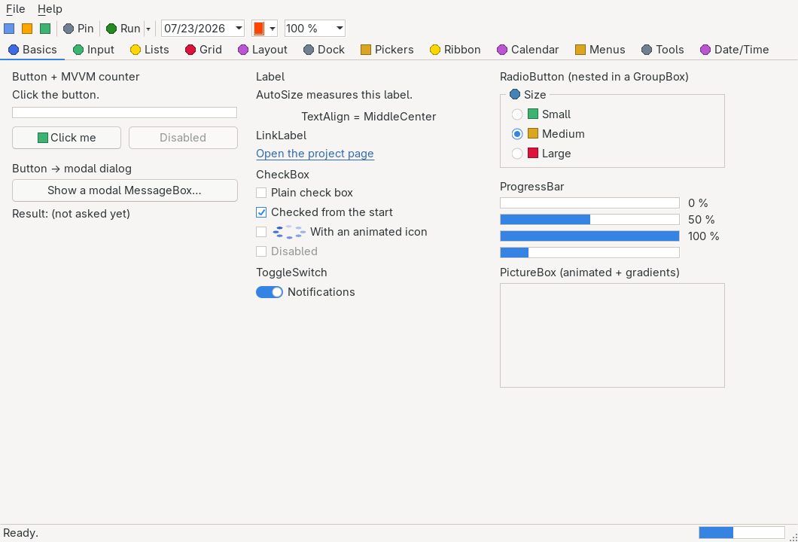

# Form

> A top-level window backed by a real native window: `Text` is the title bar, `Bounds` the frame, children realize into the client area — plus window management (`StartPosition`, `FormBorderStyle`, `WindowState`, size limits, icon, `TopMost`, `Opacity`), modeless `Show`, and modal display via `ShowDialog`/`DialogResult`.



`Hawkynt.NativeForms.Form` · strategy: **native** · peer: `IWindowPeer`

## Usage

```csharp
using Hawkynt.NativeForms;

var form = new Form
{
    Text = "Hello",
    Bounds = new(0, 0, 320, 160),
    StartPosition = FormStartPosition.CenterScreen,
    MinimumSize = new(240, 120),
};
var button = new Button { Text = "Click me", Bounds = new(20, 20, 140, 36) };
button.Click += (_, _) => button.Text = "Clicked!";
form.Controls.Add(button);
form.Load += (_, _) => Console.WriteLine("realized, about to show");
form.FormClosing += (_, e) => e.Cancel = HasUnsavedChanges();
form.FormClosed += (_, _) => Console.WriteLine("closed");

Application.Run(form);   // shows the window and blocks until it closes
```

Or subclass, as `NativeForms.Demo/MainForm.cs` does — set `Text`/`Bounds` and populate `Controls` in the constructor; `Application.Run(new MainForm())` does the rest.

## Window management

All window-management state is buffered in managed fields until the form is realized, flushed into the peer when the native window is created, and forwarded live afterwards.

- **StartPosition** — applied once, just before realization, by rewriting `Bounds` in the core: `CenterScreen` centers against `IPlatformBackend.GetScreenSize()`, `CenterParent` against the owner's bounds (falling back to the screen without an owner), `Manual` (the default) leaves `Bounds` alone. The peers never see the placement policy, only the resulting rectangle. Note the default differs from WinForms, whose default is `WindowsDefaultLocation` — a policy that has no cross-platform meaning; here an unset `StartPosition` shows the form exactly at its `Bounds`.
- **FormBorderStyle** — `None`, `FixedSingle`, `FixedDialog`, `FixedToolWindow`, `Sizable` (default). Win32 toggles the style bits live on the HWND; GTK maps to resizable/decorated/type hints, where the window manager has the final say over the exact frame.
- **WindowState** — `Normal`/`Minimized`/`Maximized`, two-way: assigning drives the native window, and native changes (the caption buttons) flow back into the property without echoing, raising `Resize`/`SizeChanged`.
- **MinimizeBox / MaximizeBox** — Win32 toggles the caption-button style bits. GTK cannot toggle individual caption buttons, so the values are **advisory** there: both off reads as a dialog type hint and the window manager decides.
- **MinimumSize / MaximumSize** — clamp user resizing (`WM_GETMINMAXINFO` on Win32, geometry hints on GTK); `Size.Empty` or a zero component leaves that axis unconstrained. Assigning clamps the current size immediately.
- **TopMost** — keeps the window above all normal windows.
- **Opacity** — clamped to 0…1. Win32 uses a layered window; GTK uses `gtk_widget_set_opacity`, which **needs a compositing window manager** to show through on Linux.
- **SetIcon(width, height, argb)** — replaces the caption/taskbar icon from raw 32-bit ARGB pixels (row-major, length = width × height), the same decoder-free pipeline as `ImageList` and `NotifyIcon`. Throws when the pixel count does not match.

User moves and resizes flow back from the peer into `Bounds` without echoing a `SetBounds` at the window; a size change (programmatic or native) raises `Resize` then `SizeChanged`.

## Lifecycle: Load, FormClosing, FormClosed

**`Load`** is raised after the form is realized and before it is first shown — the traditional home for initialization that needs live peers (measuring, focusing). Because the form unrealizes between shows, `Load` fires on *every* show: once per `Application.Run`, `Show()` or `ShowDialog()`.

**`FormClosing`** runs before the form closes — by the native close button, `Close()`, or a modal verdict — carrying a `FormClosingEventArgs` with the `CloseReason` (`UserClosing` for a platform-initiated close such as the close box or Alt+F4, `ProgrammaticClosing` while a `Close()` call — including the modal teardown a `DialogResult` verdict triggers — is on the stack). Set `e.Cancel = true` to veto and keep the window open. **`FormClosed`** follows a committed close.

`Close()` closes the form as the native close button would, running the `FormClosing` veto with `CloseReason.ProgrammaticClosing` first — it ends a modal loop, and ends `Application.Run` when it is the main window. A no-op before realization.

## Showing: Run, Show, ShowDialog

**Modeless — `Show()`.** Shows the form modelessly on the running application's backend: the form realizes, appears, and the call returns immediately; the window then lives on the already-pumping message loop and closes through the usual `FormClosing`/`FormClosed` path. Showing an already-realized form just re-shows its window. Throws `InvalidOperationException` when no message loop is running.

**Modal — `ShowDialog(owner)`.**

```csharp
var dialog = new Form { Text = "Confirm", Bounds = new(0, 0, 240, 120), StartPosition = FormStartPosition.CenterParent };
var ok = new Button { Text = "OK", Bounds = new(20, 40, 90, 30), DialogResult = DialogResult.OK };
var cancel = new Button { Text = "Cancel", Bounds = new(130, 40, 90, 30) };
dialog.Controls.AddRange(ok, cancel);
dialog.AcceptButton = ok;
dialog.CancelButton = cancel;   // assigns DialogResult.Cancel to the button, as in WinForms

if (dialog.ShowDialog(owner) == DialogResult.OK)
    Save();
```

`ShowDialog(owner)` shows the form modally: the owner (when given) is disabled while a nested native message loop runs, and the call blocks until the form closes. It needs a running message loop — call it from inside `Application.Run`, or it throws `InvalidOperationException`. On return the form **unrealizes** (its peer tree is disposed, managed state kept), so the same instance can be shown again.

The verdict chain is the WinForms one: a clicked `Button` whose `DialogResult` is not `None` walks to its owning form, sets `Form.DialogResult`, and that setter closes a modally shown form. A form closed without a verdict (close box, Alt+F4) reports `DialogResult.Cancel`.

**Enter/Escape.** The form runs a dialog-key chain — menu shortcuts, Alt+mnemonics, Tab/Shift+Tab, Enter → `AcceptButton`, Escape → `CancelButton` — fed by focused owner-drawn controls; a control that consumes those keys itself (an open drop-down, a grid edit) claims them via `IsInputKey` first. Focused *native* text widgets consume their keys inside the widget, where no key preview exists yet — a documented platform limit.

## API

Everything from [`Control`](control.md) — `Text`, `Bounds`/`Location`/`Size`, `Visible`, `Enabled`, `Controls`, focus, layout, events — plus:

Properties:

| Property | Type | Default | Description |
|---|---|---|---|
| `StartPosition` | `FormStartPosition` | `Manual` | Placement policy applied once, at show time, by rewriting `Bounds` in the core |
| `FormBorderStyle` | `FormBorderStyle` | `Sizable` | The frame the native window wears; live-toggled after realization |
| `WindowState` | `FormWindowState` | `Normal` | Normal/minimized/maximized, synced two-way with the native window |
| `MinimizeBox` / `MaximizeBox` | `bool` | `true` | Caption buttons; advisory on GTK (the window manager owns the caption) |
| `MinimumSize` / `MaximumSize` | `Size` | `Size.Empty` | Resize limits; a zero component leaves that axis unconstrained; assigning clamps the current size |
| `TopMost` | `bool` | `false` | Keeps the window above all normal windows |
| `Opacity` | `double` | `1.0` | Overall opacity, clamped to 0…1; compositor-dependent on Linux |
| `ClientSize` | `Size` | — | The size of the form. **Caveat:** WinForms subtracts the non-client frame here; no peer reports its non-client metrics yet, so for now `ClientSize` equals `Size` on every platform — a documented platform gap, not a contract |
| `DialogResult` | `DialogResult` | `None` | The verdict `ShowDialog` reports; setting a non-`None` value on a modally shown form closes it |
| `AcceptButton` | `Button?` | `null` | The button Enter clicks through the dialog-key chain (see above) |
| `CancelButton` | `Button?` | `null` | The button Escape clicks; assigning gives it `DialogResult.Cancel` when it has none |
| `ActiveControl` | `Control?` | `null` | The child holding keyboard focus, tracked from peer focus events. Assigning focuses the control; assigned before the form is shown, it becomes the initial focus instead of the first tab stop — the WinForms contract |

Events:

| Event | Description |
|---|---|
| `Load` | Raised after realization, before first show — on *every* show, since the form unrealizes between them |
| `FormClosing` | Raised before the form closes, with `CloseReason`; settable `Cancel` vetoes |
| `FormClosed` | Raised after the window closed |
| `Resize` / `SizeChanged` | Raised (in that order) whenever the form's size changes — programmatically, by a native resize, or on minimize/maximize/restore |

Methods:

| Method | Description |
|---|---|
| `Show()` | Shows the form modelessly and returns immediately. Throws without a running message loop |
| `ShowDialog(Form? owner = null)` | Shows the form modally, blocks until it closes, returns `DialogResult` (`Cancel` when closed without a verdict). Throws without a running message loop |
| `Close()` | Closes the form as the native close button would, running the `FormClosing` veto first; no-op before realization |
| `SetIcon(int, int, ReadOnlySpan<int>)` | Replaces the caption/taskbar icon from 32-bit ARGB pixels |
| `OnLoad` / `OnFormClosing` / `OnFormClosed` / `OnResize` / `OnSizeChanged` | `protected virtual` raisers for subclasses |

## Differences from System.Windows.Forms.Form

- **`StartPosition` defaults to `Manual`**, not `WindowsDefaultLocation` (see window management above).
- **`ClientSize` currently equals `Size`** — no non-client subtraction yet (see the API table).
- **No `KeyPreview`.** The form-level dialog-key chain covers shortcuts, mnemonics, Tab, Enter and Escape from owner-drawn surfaces, but there is no general first-look at every keystroke; native widgets consume their keys internally.
- **`Load` fires on every show**, because the form unrealizes between shows (WinForms fires it once per handle creation — effectively the same rule, but handles die more often here).
- **MDI is a non-goal** (see Notes).

## Notes

**Realization.** A `Form` is plain managed state until `Application.Run`, `Show` or `ShowDialog`; set title, bounds, window-management properties and children in any order beforehand and they flush into the native window at realization. The whole child tree realizes depth-first — nesting under `Panel`/`GroupBox`/`TabPage` works (see [control.md](control.md)).

**Theming.** The window is fully native (an HWND on Win32, a `GtkWindow` on GTK), so the frame, title bar and background are the platform's own — nothing to configure.

**MDI is a non-goal.** `MdiParent`/`MdiChildren` is a legacy Windows-only shell metaphor with no native counterpart on GTK or Cocoa; NativeForms deliberately does not implement it. Use multiple top-level forms or a `TabControl` instead.

**Platform limits, honestly.** GTK treats `MinimizeBox`/`MaximizeBox` as advisory and lets the window manager decide the frame `FormBorderStyle` requests; `Opacity` on Linux needs a compositing window manager. Win32 applies all of these directly.

**Testing.** Headless: `Application.Run(form, new HeadlessBackend())` returns immediately; assert against the recorded window peer (title, children, shown, border style, state) and raise its `CloseRequested`/`Closed`/`BoundsChangedByUser`/`WindowStateChanged` to test the veto and write-back — see `NativeForms.Tests/RealizationTests.cs`, `FormPolishTests.cs` and `ModalTests.cs`.
