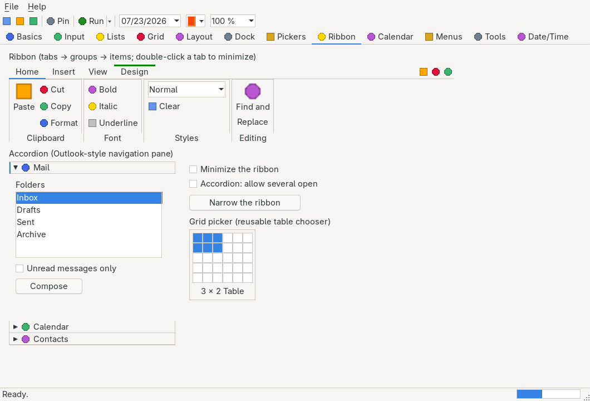

# GridPicker

> The Office-style table-size chooser: a grid of cells the pointer sweeps to pick an N×M table, the


> hovered top-left block highlighted in the accent, a live "C × R Table" caption, and a click (or
> Enter) that commits. Reusable and decoupled — drop it onto a form, host it in a drop-down, or let a
> `RibbonGridButton` pop it up.

`Hawkynt.NativeForms.GridPicker` · strategy: **owner-drawn** · peer: `ICanvasPeer`

## Usage

```csharp
var picker = new GridPicker { Bounds = new(0, 0, 120, 128), MaxColumns = 6, MaxRows = 5 };
picker.RangeSelected += (_, e) => InsertTable(e.Rows, e.Columns);
form.Controls.Add(picker);
```

The ribbon exposes it as a drop-down through [`RibbonGridButton`](ribbon.md):

```csharp
var table = new RibbonGridButton("Table") { MaxColumns = 10, MaxRows = 8 };
table.RangeSelected += (_, e) => InsertTable(e.Rows, e.Columns);
```

## API

| Property | Type | Default | Description |
|---|---|---|---|
| `MaxColumns` | `int` | `10` | The greatest number of columns the grid offers; at least one. |
| `MaxRows` | `int` | `8` | The greatest number of rows the grid offers; at least one. |
| `Columns` | `int` (get) | `0` | The hovered column count, or `0` while nothing is hovered. |
| `Rows` | `int` (get) | `0` | The hovered row count, or `0` while nothing is hovered. |
| `PreferredSize` | `Size` (get) | — | The natural pixel size of the grid plus its caption strip, under the current theme. |

| Method | Description |
|---|---|
| `SetSelection(int rows, int columns)` | Sets the hovered block programmatically, clamped into the grid. |

| Event | Description |
|---|---|
| `RangeSelected` | `EventHandler<GridRangeEventArgs>` — raised when a valid block is committed by click or Enter. `GridRangeEventArgs` carries `Rows` and `Columns`. |
| `Canceled` | Raised when the pick is cancelled with Escape. |

## Notes

- **Hover to size, click to commit.** Moving the pointer highlights the top-left block under it and
  updates `Rows`/`Columns`; a left click (or Enter) commits it through `RangeSelected`; leaving the
  control clears the highlight.
- **Keyboard.** Arrow keys move the hovered block (the first press lands on the first cell), Enter
  commits, Escape raises `Canceled`.
- **Zero per-frame allocation.** The "C × R Table" caption is cached and rebuilt only when the
  hovered block changes, so a steady-state repaint allocates nothing. A `GridPicker` measures under
  the owner-drawn footprint budget.
- **One engine everywhere.** The standalone control and the ribbon's Table drop-down share a single
  `GridPickerCore`, so they stay pixel- and behavior-identical.
- Painted with the platform `ITheme` (`Accent` block, `FieldBackground` cells, `Border`,
  `ControlBackground`, `ControlText`, `DefaultFont`); testable headlessly through the test backend's
  recording canvas.

## Differences from the Office table picker

- **The grid does not grow past `MaxColumns`/`MaxRows`.** Word extends the grid when the pointer is
  dragged beyond its edge; here the grid is fixed at the maximum you set, so size it to the largest
  table the picker should offer.
