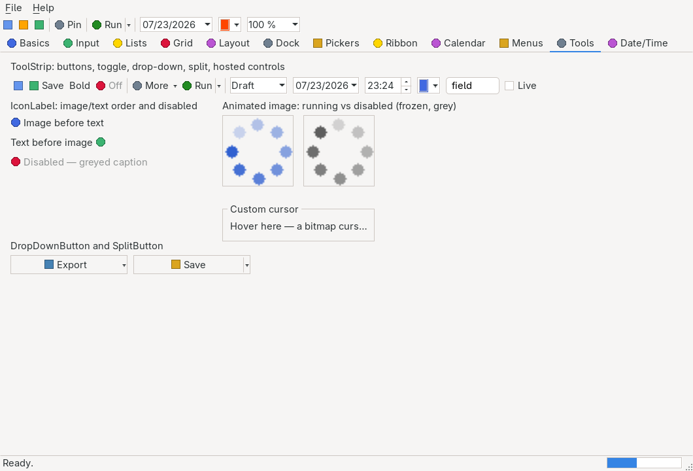

# IconLabel

> A caption that renders an image **and** text together, owner-drawn in the platform theme — the pairing the native [`Label`](label.md) widget cannot do.



`Hawkynt.NativeForms.IconLabel` · strategy: **owner-drawn** · peer: `ICanvasPeer`

## Usage

```csharp
var label = new IconLabel
{
    Bounds = new(20, 20, 200, 24),
    Text = "Documents",
    Image = icons.GetImage(0),
};
form.Controls.Add(label);
```

Stack the icon above the caption and centre the block:

```csharp
var tile = new IconLabel
{
    Text = "Downloads",
    Image = icons.GetImage(1),
    TextImageRelation = TextImageRelation.ImageAboveText,
    TextAlign = ContentAlignment.MiddleCenter,
    AutoSize = true,
};
```

## API

### Properties

| Name | Type | Default | Description |
|---|---|---|---|
| `Image` | `IImage?` | `null` | The image shown beside the caption, or `null` for text only. |
| `TextImageRelation` | `TextImageRelation` | `ImageBeforeText` | How the image sits relative to the text. |
| `TextAlign` | `ContentAlignment` | `MiddleLeft` | Where the whole image+text block anchors within the bounds. |
| `ImageAlign` | `ContentAlignment` | `MiddleCenter` | Where the image anchors when it is the *only* content. |
| `AutoSize` | `bool` | `false` | Sizes the label to fit image, gap and text in the ambient font. |

The inherited `Text` is the caption. Also honours the ambient `Font`, `ForeColor` and `BackColor`.

Inherits the common members of [`Control`](control.md) plus the owner-drawn surface of `OwnerDrawnControl`.

## Notes

- **Why this exists.** [`Label`](label.md) is backed by the platform's native static widget, and no toolkit renders both parts in one of those: Win32's `SS_BITMAP` static is image-only and GTK swaps the whole widget for a `GtkImage`. A captioned `Label` therefore keeps its text and drops its image. `IconLabel` gives up the native widget to get both.
- Layout goes through the shared `ContentLayout` helper (PRD §5) — the same geometry [`Button`](button.md), [`CheckBox`](checkbox.md) and [`GroupBox`](groupbox.md) use — so an icon sits beside a caption identically everywhere, with a 4 px gap.
- `TextAlign` anchors the combined block; `ImageAlign` only applies when there is no text, matching how Windows Forms places an image-only label.
- Right-to-left mirrors which side the icon leads on and mirrors the block anchor, like the `CheckBox` face.
- Takes no focus and handles no input, exactly like `Label`.
- Disabled greys the caption with the theme's disabled text colour.
- Construction costs ~320 B, inside the 768 B owner-drawn budget (PRD §4); a steady-state repaint allocates 0 bytes — `AutoSize` measures on content changes, never from `OnPaint`.
- `IconLabelTests` pin the surface headlessly: both parts drawn, all four relations, the image-only anchor, `AutoSize` in both axes, ambient font/colour adoption, the disabled colour, RTL mirroring and clipping.

## Differences from WinForms

Windows Forms renders image and text in one `Label` because GDI+ draws the whole control. Here that is a separate type rather than a mode on `Label`, so the plain `Label` keeps its cheap native widget and only the labels that need both pay for a canvas. `TextImageRelation` is offered on the label itself, which WinForms exposes only on button-family controls.
