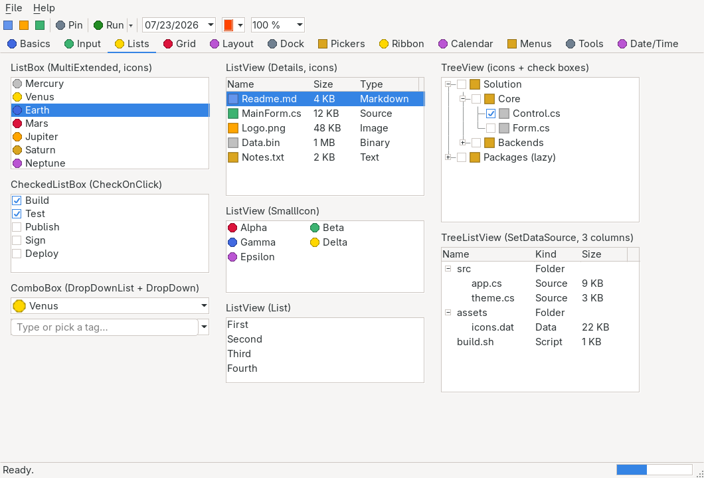

# ImageList

> Backend-independent icon storage shared by list, tree, combo and toolbar controls: images are added as raw 32-bit ARGB pixels long before any backend exists and are materialized into native bitmaps lazily, the first time a realized control paints them.



`Hawkynt.NativeForms.ImageList` · not a control — a `sealed class : IDisposable` holding pixel data

## Usage

```csharp
var icons = new ImageList(16);            // 16×16; or new ImageList(new Size(w, h))
int document = icons.Add(documentPixels); // int[256] of row-major ARGB — no backend needed yet
int modified = icons.AddBadged(document, dotPixels, 6, 6); // bottom-right badge overlay

listView.SmallImageList = icons;          // controls materialize entries on first paint
```

## API

### Constructors

| Signature | Description |
|---|---|
| `ImageList(Size imageSize)` | Creates a list whose images are all `imageSize` pixels. Throws `ArgumentOutOfRangeException` when a dimension is ≤ 0. |
| `ImageList(int edgeLength)` | Creates a list of square `edgeLength`-pixel images. |

### Properties

| Name | Type | Description |
|---|---|---|
| `ImageSize` | `Size` (read-only) | The fixed pixel size every image in this list has — exactly like the WinForms namesake. |
| `Count` | `int` (read-only) | The number of images stored. |

### Methods

| Name | Description |
|---|---|
| `Add(ReadOnlySpan<int> argb)` | Adds an image from row-major 32-bit ARGB pixels and returns its index. Throws `ArgumentException` when the pixel count is not `ImageSize.Width * ImageSize.Height`. |
| `AddPng(ReadOnlySpan<byte> png)` | Decodes a PNG (the core decoder's 8-bit non-interlaced subset) and adds it, returning its index; a size other than `ImageSize` is nearest-neighbor-resampled to fit. Throws `FormatException` outside the subset. |
| `AddIco(ReadOnlySpan<byte> ico)` | Decodes the ICO entry closest to `ImageSize` and adds it, resampled the same way, returning its index. |
| `AddBadged(int baseIndex, ReadOnlySpan<int> badgeArgb, int badgeWidth, int badgeHeight, ContentAlignment corner = BottomRight)` | Adds a **copy** of the base image with a badge composed onto it (status overlays like "modified" or "locked") and returns the new entry's index; the base entry stays untouched. Throws `ArgumentOutOfRangeException` for a bad index or a badge that is empty or larger than `ImageSize`, `ArgumentException` for a pixel-count mismatch. |
| `Clear()` | Removes all images and disposes any realized native bitmaps. |
| `Dispose()` | Disposes all realized native bitmaps; the pixel data stays usable, so the list can re-materialize later. |

## Notes

- **Pre-realization storage**: `Add` works with no backend present — typically while a form is still being constructed — because only raw pixels are stored. The native `IImage` for an entry is created against the running backend on first use (internal `GetImage`) and cached per index; a backend swap (possible only in tests) drops the foreign cache and rebuilds.
- **AddBadged blending**: a straight-alpha Porter-Duff "over" in integer math — opaque badge pixels overwrite, fully transparent ones preserve the base, semi-transparent ones mix (e.g. 50 % red over opaque blue yields `FF80007F`). `corner` anchors the badge at one of the nine `ContentAlignment` points, bottom-right by default.
- `Dispose` differs from `Clear`: `Clear` drops the pixels too, `Dispose` only the native bitmaps.
- `ImageListTests` pin the backend-free adds, the size validation, lazy materialization with per-index caching, the backend-swap rebuild and pixels-survive-dispose; `ImageListBadgeTests` pin the overwrite/preserve/blend cases, all corner anchors, base immutability and the argument validation.
- Consumed via `ImageList` + `ImageIndex` pairs across the toolkit — [`ListView`](listview.md), [`TreeView`](treeview.md), [`ComboBox`](combobox.md), [`TabControl`](tabcontrol.md) and the strips.

## Differences from System.Windows.Forms.ImageList

- **No `Images` collection.** The WinForms `ImageCollection` (with its `Image` objects, string keys and removal-by-key) maps to the flat API above: `Add`/`AddPng`/`AddIco` return the index you hand to a control's `ImageIndex`, `Count` sizes the list, `Clear` empties it. There is no `ImageKey` — indices only — and no per-entry removal.
- **No `ColorDepth`, no `TransparentColor`**: storage is fixed 32-bit ARGB with real alpha.
- `AddBadged` (compose a status badge onto a copy of an entry) is a NativeForms extension.
