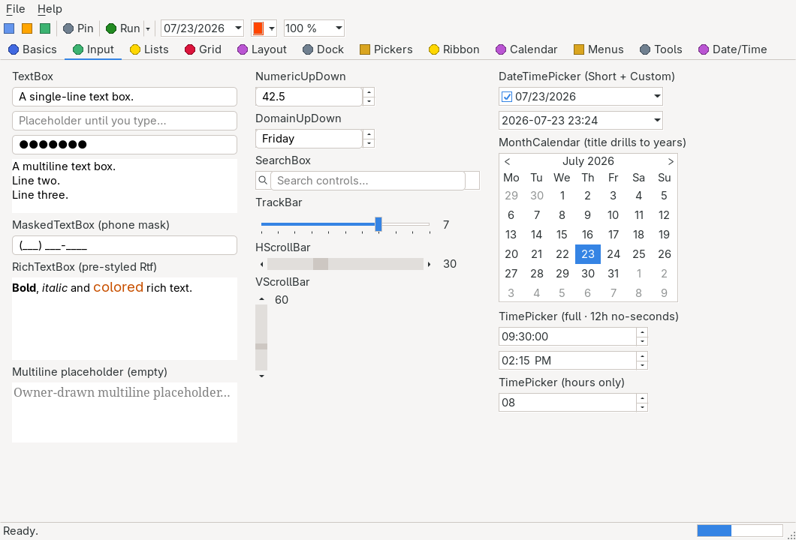

# MaskedTextBox

> A [`TextBox`](textbox.md) whose content is forced through an input mask — phone numbers, dates, license keys. The mask engine lives entirely in the core, so it behaves identically over every backend's plain native text widget.



`Hawkynt.NativeForms.MaskedTextBox` · strategy: **native** (core mask engine over the `TextBox` widget) · peer: `ITextBoxPeer`

## Usage

```csharp
var phone = new MaskedTextBox { Mask = "(000) 000-0000", Bounds = new(20, 20, 160, 24) };
form.Controls.Add(phone);

phone.Text = "1234567890";                    // maps into the slots: "(123) 456-7890"
var complete = phone.MaskCompleted;           // true — every required slot is filled
var raw = phone.GetTextWithoutPromptOrLiterals(); // "1234567890"
```

## The mask language

The familiar Windows Forms subset:

| Character | Meaning |
|---|---|
| `0` | Required digit |
| `9` | Optional digit |
| `L` | Required letter |
| `?` | Optional letter |
| `A` | Required letter or digit |
| `a` | Optional letter or digit |
| `&` | Any character, required |
| `C` | Any character, optional |
| `\` | Escapes the next character into a literal |
| anything else | A literal, rendered as-is and never edited |

Unfilled slots render as `PromptChar`.

## API

### Properties

| Name | Type | Default | Description |
|---|---|---|---|
| `Mask` | `string` | `""` | The input mask. Setting it re-maps the current content into the new mask; content that no longer fits is discarded (all-prompts rendering). An empty mask turns the box back into a plain `TextBox`. |
| `PromptChar` | `char` | `'_'` | The character rendered in unfilled slots. Changing it re-renders the content; slots holding the old prompt adopt the new one. |
| `MaskCompleted` | `bool` (get) | `true` | Whether every required slot is filled. Always `true` without a mask. |

### Events

| Name | Description |
|---|---|
| `MaskedTextChanged` | Raised after a candidate value was successfully applied through the mask and changed the text. Fires alongside the inherited `TextChanged` while a mask is active. |
| `MaskInputRejected` | Raised when a candidate value fails to map into the mask and is reverted; `MaskInputRejectedEventArgs` carries the failing `Position` and a `MaskedTextResultHint` in `RejectionHint`. |

### Methods

| Method | Description |
|---|---|
| `GetTextWithoutPromptOrLiterals()` | Returns only the characters the user actually entered — mask literals and prompt characters stripped. Without a mask this is simply `Text`. |

Inherits the members of [`TextBox`](textbox.md) (selection API, `ReadOnly`, `CharacterCasing`, …) and the common members of [`Control`](control.md). `CharacterCasing` is applied before the mask, so `Mask = "LL"` with `Upper` casing accepts `"ab"` and renders `"AB"`.

## Notes

- **Validation is transactional, whole-text — an honest trade-off.** Peers report text changes as whole values (there are no per-keystroke events on `ITextBoxPeer`), so every candidate — programmatic write or user edit — is mapped into the mask's slots as a unit. A candidate that maps cleanly becomes the new content; one that does not is rejected by reverting the widget to the last valid rendering, the same corrective-push mechanism `TextBox.CharacterCasing` uses. A rejected edit raises no `TextChanged` at all.
- The consequence: the engine cannot steer the caret slot-by-slot the way Windows Forms does. Free-form edits in the middle of the text re-flow the remaining input through the mask, and a prompt character in the input always reads as an empty slot.
- Mapping rules: literal positions render themselves and consume a matching input character when one is next (so pasting `"(123) 456-7890"` into the phone mask works as well as pasting `"1234567890"`); input remaining after the last mask position rejects the whole candidate.
- `MaskedTextBoxTests` pin the behavior headlessly: rendering, partial input, rejection with revert, prompt/mask changes, and the raw-text extraction.
- Not yet implemented (see [docs/PRD.md](../PRD.md) §7.3): per-keystroke caret steering through the slots — it needs key events on `ITextBoxPeer`.

## Differences from System.Windows.Forms.MaskedTextBox

- **The mask language is exactly the table above** — `0 9 L ? A a & C \` and nothing else. WinForms' remaining codes are *not* special here: `#` (digit/sign/space), the shift codes `< > |`, and the culture placeholders `. , : / $` all fall through as plain literals, rendered verbatim with no culture-aware substitution.
- **Validation is transactional, whole-text** (see Notes) — no per-keystroke slot steering, no caret placement per slot.
- `MaskInputRejected` exists as in WinForms; there is no `MaskFull` (use `MaskCompleted`), no `MaskedTextProvider`, no `TextMaskFormat`/`CutCopyMaskFormat` (use `GetTextWithoutPromptOrLiterals()`), and no `BeepOnError`.
