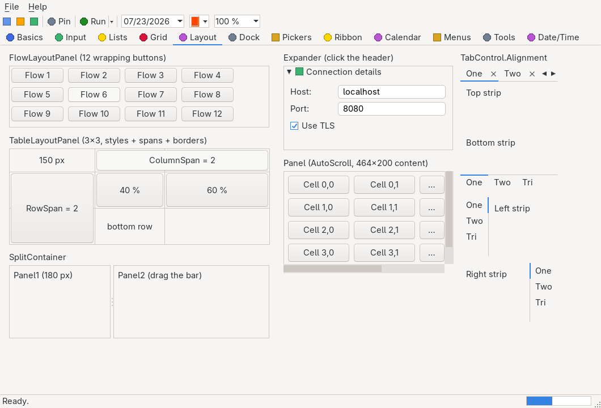

# Panel

> A simple owner-drawn container that fills itself with the theme's control background and optionally draws a border — a grouping surface for other controls, with themed scrollbars when `AutoScroll` children overflow.



`Hawkynt.NativeForms.Panel` · strategy: **owner-drawn** · peer: `ICanvasPeer`

## Usage

```csharp
var panel = new Panel { Bounds = new(10, 10, 300, 200), BorderStyle = BorderStyle.FixedSingle, AutoScroll = true };
panel.Controls.Add(new Label { Text = "Inside", Bounds = new(8, 8, 120, 20) });
panel.Controls.Add(new Button { Text = "Below the fold", Bounds = new(8, 260, 120, 24) }); // scrollable
form.Controls.Add(panel);
```

## API

### Properties

| Name | Type | Default | Description |
|---|---|---|---|
| `BorderStyle` | `BorderStyle` | `BorderStyle.None` | The border drawn around the panel; changing it invalidates the control. |
| `AutoScroll` | `bool` | `false` | Whether the panel scrolls children that overflow its client area. Turning it off snaps the scroll offset back to zero. |
| `AutoScrollPosition` | `Point` | `(0, 0)` | The scroll offset, negated exactly like its Windows Forms namesake: a panel scrolled 10 px down reports `(0, -10)`. Assigning accepts either sign and scrolls to the absolute offset, clamped to the content extent. |

`BorderStyle` (enum, defined alongside `Panel`): `None` (no border), `FixedSingle` (a single flat line), `Fixed3D` (a sunken 3-D edge).

Inherits the common members of [`Control`](control.md), plus the owner-drawn surface of `OwnerDrawnControl` (`Invalidate`, `Focus`).

## Notes

- Children are real nested children: added to the inherited `Controls` collection, they realize as
  native peers inside the panel's canvas peer. The panel itself takes no focus and handles no input
  beyond its scrollbars.
- With `AutoScroll` on, themed scrollbars (the shared `ScrollBarRenderer`) paint only while the
  content extent — the union bottom-right corner of all children — overflows the client area; each
  bar steals room from the other's axis. The wheel scrolls three theme rows per notch, the thumb
  drags, and a click in the track pages by one viewport.
- Scrolling physically moves the child *peers*; each child's logical `Bounds` stays untouched.
  Disabling `AutoScroll` resets the offset and restores the peer positions.
- Painted with the platform `ITheme` (`ControlBackground`, `Border`, scrollbar colors), so the panel matches the host desktop; testable headlessly through the test backend's recording canvas.
- `Fixed3D` currently draws only the top and left sunken edges.
- [`FlowLayoutPanel`](flowlayoutpanel.md) and [`TableLayoutPanel`](tablelayoutpanel.md) build on this control and lay their children out themselves; plain `Panel` positions children by `Bounds` alone.
