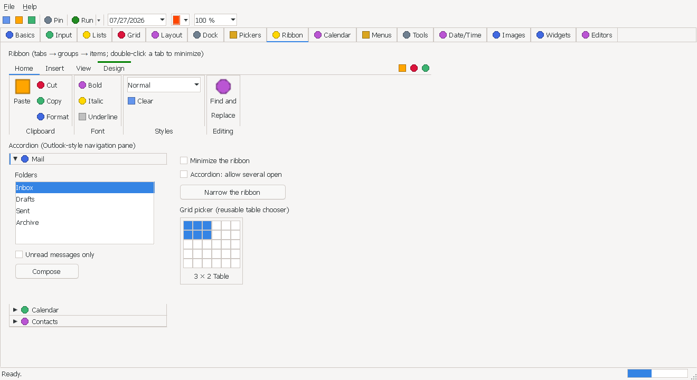

# Ribbon

> An Office-style ribbon: tabs across the top, each showing its groups side by side — every group a


> framed box with its caption along the bottom edge. Items come large (big icon over the caption,
> full group height) or small (three stacked per column). Groups that no longer fit collapse into a
> drop-down button that opens the group's layout in a flyout; `Minimized` collapses the ribbon onto its
> tab strip and a tab click then floats that tab's groups as a transient flyout. A `RibbonGridButton`
> opens an Office-style table picker; `RibbonComboBox` and `RibbonSpinner` are owner-drawn fields that
> work on all of these surfaces.

`Hawkynt.NativeForms.Ribbon` · strategy: **owner-drawn** · peer: `ICanvasPeer`

## Usage

```csharp
var ribbon = new Ribbon { Bounds = new(0, 0, 800, 140) };

var home = new RibbonTab("Home");
var clipboard = new RibbonGroup("Clipboard");
clipboard.Items.AddRange(
    new RibbonButton("Paste"),                          // large by default
    new RibbonButton("Cut", RibbonItemSize.Small),
    new RibbonButton("Copy", RibbonItemSize.Small),
    new RibbonButton("Format", RibbonItemSize.Small));  // three smalls = one column
home.Groups.Add(clipboard);

ribbon.Tabs.AddRange(home, new RibbonTab("Insert"));
form.Controls.Add(ribbon);
```

Items are `ToolStripItem`s, so commands wire up exactly as they do on a toolbar:

```csharp
var paste = new RibbonButton("Paste") { ImageList = icons, ImageIndex = pasteIcon };
paste.Command = new RelayCommand(Paste, CanPaste);   // CanExecute drives Enabled
```

A group can host a real control among its buttons:

```csharp
var styles = new RibbonGroup("Styles");
styles.Items.Add(new RibbonHostItem(styleComboBox) { HostWidth = 140 });
```

Fields are drawn by the ribbon, take one small row each and keep working in a collapsed group's
flyout — prefer them to hosting a `ComboBox` or `NumericUpDown`:

```csharp
var setup = new RibbonGroup("Page Setup");
var paper = new RibbonComboBox("Paper") { FieldWidth = 90 };
paper.Items.AddRange(["A4", "A5", "Letter", "Legal"]);
paper.SelectedIndex = 0;
paper.SelectedIndexChanged += (_, _) => SetPaper(paper.SelectedItem);
var margin = new RibbonSpinner("Margin") { FieldWidth = 60, Minimum = 0, Maximum = 50, Value = 20 };
margin.ValueChanged += (_, _) => SetMargin(margin.Value);
setup.Items.AddRange(paper, margin);
```

A `RibbonGridButton` opens an Office-style table-size [`GridPicker`](gridpicker.md) under itself:

```csharp
var table = new RibbonGridButton("Table") { MaxColumns = 10, MaxRows = 8 };
table.RangeSelected += (_, e) => InsertTable(e.Rows, e.Columns);
tables.Items.Add(table);
```

Give it the height its items need at the current font and scaling, rather than a fixed number of
pixels that only fits one display:

```csharp
ribbon.Height = ribbon.NaturalHeight;
ribbon.PreferredHeightChanged += (_, _) => ribbon.Height = ribbon.Minimized ? ribbon.TabStripHeight : ribbon.NaturalHeight;
```

The ribbon has no automatic layout owner, so re-flow the content below when it minimizes:

```csharp
ribbon.PreferredHeightChanged += (_, _) => LayoutContentBelow(ribbon.Bottom);
```

## API

### Ribbon properties

| Property | Type | Default | Description |
|---|---|---|---|
| `ContextualTabGroups` | `RibbonContextualTabGroupCollection` | empty | Colour-coded tab families (`RibbonContextualTabGroup(text, color)`) shown only while `Visible` is set. Their tabs live in `Tabs` but are filtered out of the strip, hit-test and keyboard navigation while hidden, and wear the group colour while shown; hiding the group holding the selection hands it to the nearest shown tab. |
| `GroupAreaHeight` | `int` (get) | remaining height | Pixel height of the group area; `0` while minimized. |
| `ImageList` | `ImageList?` | `null` | The icons the groups' and items' image indices point into. |
| `Minimized` | `bool` | `false` | Collapses the ribbon onto its tab strip — the control shrinks its own `Height` to `TabStripHeight` (remembering the expanded height to restore) so a plain container re-flows the content below. Hosted controls go with it; the tabs stay clickable and open a flyout. |
| `NaturalHeight` | `int` (get) | measured | The height at which every item fits: the tab strip, three small rows at the theme's row height or a large icon over two caption lines (whichever is taller), the group padding and a one-line caption strip. Follows the theme's font and row height, and so the display's scaling. Size the ribbon to this rather than to a fixed number: `ribbon.Height = ribbon.NaturalHeight`. |
| `PreferredHeight` | `int` (get) | `Height` | The height the ribbon wants: `TabStripHeight` while minimized, else the strip plus a full group area. Minimizing already shrinks the control to it. |
| `QuickAccessItems` | `RibbonQuickAccessCollection` | empty | Icon-only `RibbonButton` commands painted at the right of the tab strip, reachable from any tab. Each button's `Click`/`Command`, `Enabled` and icon behave as anywhere else; the tabs are clipped so they never run under the toolbar. |
| `SelectedIndex` | `int` | `-1` | Index of the selected tab, `-1` while there are no tabs. Out-of-range values coerce to `-1`. |
| `SelectedTab` | `RibbonTab?` | `null` | The selected tab; setting selects by `IndexOf`. |
| `Tabs` | `RibbonTabCollection` | empty | The tabs, left to right. The first tab added becomes the selected one. |
| `TabStripHeight` | `int` (get) | theme row height + 4 | Pixel height of the tab strip. |

### Ribbon events

| Event | Description |
|---|---|
| `MinimizedChanged` | Raised after `Minimized` changes. |
| `PreferredHeightChanged` | Raised after `PreferredHeight` changes because the ribbon was minimized or restored, and after `NaturalHeight` changes — once the font can first be measured on realization, and when a theme or DPI change alters the row height or font — so a host can resize the ribbon and re-flow the content below it. |
| `SelectedIndexChanged` | Raised when `SelectedIndex` changes. |

### RibbonTab

| Property | Type | Default | Description |
|---|---|---|---|
| `Groups` | `RibbonGroupCollection` | empty | The groups shown while this tab is selected, left to right. |
| `Tag` | `object?` | `null` | Caller-owned data; the toolkit never reads it. |
| `Text` | `string` | `""` | The caption in the tab strip. |

Constructors: `RibbonTab()` and `RibbonTab(string text)`.

### RibbonGroup

| Property | Type | Default | Description |
|---|---|---|---|
| `Bounds` | `Rectangle` (get) | empty | The group's laid-out rectangle, as of the last layout pass — empty while minimized or on an unselected tab. |
| `ImageIndex` | `int` | `-1` | Index of the icon the collapsed drop-down button shows. |
| `ImageKey` | `string?` | `null` | The keyed alternative to `ImageIndex` (index wins when both are set). |
| `IsCollapsed` | `bool` (get) | `false` | Whether the group is currently folded into its drop-down button. Recomputed on every layout pass. |
| `Items` | `ToolStripItemCollection` | empty | The items, laid out left to right in columns. |
| `Tag` | `object?` | `null` | Caller-owned data. |
| `Text` | `string` | `""` | The caption painted along the group's bottom edge. |

Constructors: `RibbonGroup()` and `RibbonGroup(string text)`.

### Items

`RibbonItem` is the abstract base, deriving from [`ToolStripItem`](toolstrip.md) — so every item
already carries `Text` (with `&` mnemonic parsing), `Image` / `ImageList` + `ImageIndex`, `Enabled`,
`Visible`, `Tag`, `Command`, the `Click` event and `PerformClick()`.

| Property | Type | Default | Description |
|---|---|---|---|
| `ItemSize` | `RibbonItemSize` | `Large` | Whether the item takes the full group height or one of three stacked rows. |

| Type | Adds |
|---|---|
| `RibbonButton` | Nothing — a push button. Constructors: `()`, `(string text)`, `(string text, RibbonItemSize size)`. |
| `RibbonToggleButton` | `Checked` (`bool`) and `CheckedChanged`; a click flips `Checked` and the ribbon paints it held down. Same constructors. |
| `RibbonHostItem` | `Control` (the hosted control) and `HostWidth` (`int`, default `120`). Constructor: `(Control control)`; defaults to `Small`. |
| `RibbonComboBox` | A drop-down list field: `Items` (`ObservableList<string>`, created on first use), `SelectedIndex` (`int`, `-1` = none; out of range selects nothing, list edits keep the same entry selected), `SelectedItem` (`string?`), `SelectedIndexChanged`, and `FieldWidth`. Clicking it opens the entries under the box; the arrows walk the open list, Enter commits, Escape closes it unchanged; with the box clicked and the list closed, Up/Down change the selection and Alt+Down / F4 open it. Constructors: `()`, `(string text)` — the text is the caption left of the box. |
| `RibbonSpinner` | A numeric up/down field: `Minimum` (`0`), `Maximum` (`100`), `Value` (always clamped; raising `Minimum` past `Maximum` drags it along and vice versa), `Increment` (`1`, never negative), `DecimalPlaces` (`0`–`28`), `ValueChanged`, and `FieldWidth`. The arrows step it; clicking the number edits it — digits, the culture's decimal separator when decimals are shown and a minus sign only when `Minimum` is below zero, the first keystroke replacing the value. Enter, a click elsewhere, focus loss or the flyout closing commits (rounded to `DecimalPlaces`, clamped); an entry that does not parse reverts, Escape cancels, Up/Down step while editing. Same constructors. |
| `RibbonFieldItem` | The abstract base of the two fields: `FieldWidth` (`int`, default `80`, positive) — the width of the value box, beside the caption and optional icon. A field always takes one stacked row, whatever its `ItemSize`. |
| `RibbonGridButton` | `MaxColumns` (`int`, default `10`), `MaxRows` (`int`, default `8`) and `RangeSelected` (`EventHandler<GridRangeEventArgs>`). A click opens a [`GridPicker`](gridpicker.md) in a popup under the button instead of firing a plain click; `RangeSelected` reports the chosen `Rows`×`Columns`. Same constructors as `RibbonButton`. |

### RibbonItemSize

| Value | Meaning |
|---|---|
| `Large` | A big icon above the caption, filling the group's content height — the prominent, single-column form. The default. |
| `Small` | A small icon beside the caption, one third of the content height, so three stack into one column. |

## Notes

- **Items are not controls.** They own no peer and no bounds; the ribbon lays them out and paints
  them, so a hundred buttons cost a hundred small objects rather than a hundred native widgets. A
  `RibbonButton` measures ~120 bytes.
- **`RibbonHostItem` is the exception** — it hosts a real `Control`, which the ribbon parents into
  itself, positions from the group layout, and whose peer it hides while the owning tab is
  unselected, the ribbon is minimized, or the group has collapsed. The control's own `Visible` flag
  is never clobbered.
- **Layout.** Items fill columns left to right: a large item is a column of its own; consecutive
  small items stack three to a column. A group is as wide as its columns, or as its caption when
  that is wider, plus padding.
- **Overflow.** When the groups outgrow the width, the rightmost ones collapse — one at a time,
  Office-style — into a fixed-width drop-down button that opens the group's own layout, at its
  natural width, in a light-dismiss flyout under the button. Every item works there as on the
  expanded ribbon: a button runs and closes the flyout, a field keeps it open for the next value, a
  combo box's list opens chained to it. Escape or an outside click closes it, committing a pending
  spinner entry. Widening the ribbon unfolds the groups again.
- **Hosted controls in a flyout.** A `RibbonHostItem` is never moved into a flyout — neither the
  collapsed group's nor the minimized tab flyout. Re-parenting a live native widget into a
  non-activating popup breaks its keyboard focus and input on both backends, so its slot paints a
  recessed placeholder instead, and the control stays hidden until its group unfolds. Use
  `RibbonComboBox` / `RibbonSpinner` for values that must stay editable when a group collapses.
- **Minimize.** `Minimized` collapses the ribbon onto its tab strip: the control shrinks its own
  `Height` to `TabStripHeight`, remembers the height to restore, and raises `PreferredHeightChanged`
  so a plain container can lift the content below (there is no automatic layout owner). Restoring
  grows it back. Double-clicking a tab toggles `Minimized`.
- **Tab-click flyout.** While minimized, clicking a tab floats that tab's groups as a transient
  flyout — a light-dismiss popup (the same `IPopupPeer` engine the menus and drop-downs use)
  anchored directly under the strip, full ribbon width, painting exactly the group area the expanded
  ribbon would. It dismisses on an outside click, on Escape, and once a button inside it is activated;
  selecting a different tab swaps it. Fields work in it; a collapsed group in it opens its own flyout
  chained to it; hosted controls show a placeholder (see above).
- **Keyboard** (the control is focusable): Left/Right move the tab selection without wrapping,
  Ctrl+Tab / Ctrl+Shift+Tab cycle with wraparound.
- **Measurement is cached.** Every caption width is cached and dropped only when the caption changes
  or the theme font moves; the font snapshot is held once per ribbon rather than once per item, so a
  two-hundred-button ribbon carries one font key. Nothing on the pointer path re-measures text, and
  a steady-state repaint allocates zero bytes.
- Painted with the platform `ITheme` (`ControlBackground`, `HeaderBackground`, `Accent`, `Border`,
  `HeaderText`, `ControlText`, `SelectionText`, `DisabledText`, `DefaultFont`); testable headlessly
  through the test backend's recording canvas.
- Complete per [docs/PRD.md](../PRD.md) §7.9, with two deliberate omissions noted below.

## Differences from the Office ribbon

- **Two-line captions on large items.** A large-item caption past `_MaxLargeCaptionWidth` wraps at
  the space split that makes the wider line narrowest, keeping the column compact; the split lines are
  cached (one lazy object per wrapping item) so the paint path allocates nothing once warm.
- **No application (File) menu and no KeyTips.**
  A `MenuStrip` above the ribbon covers the application-menu case.
- **Collapse order is right-to-left**, not priority-driven — there is no per-group priority.
- **No auto-layout owner.** Minimizing changes the ribbon's own height and raises
  `PreferredHeightChanged`; a host re-flows the content below off that, rather than the ribbon
  pushing a docked layout the way the WinForms `ToolStripContainer` does.
